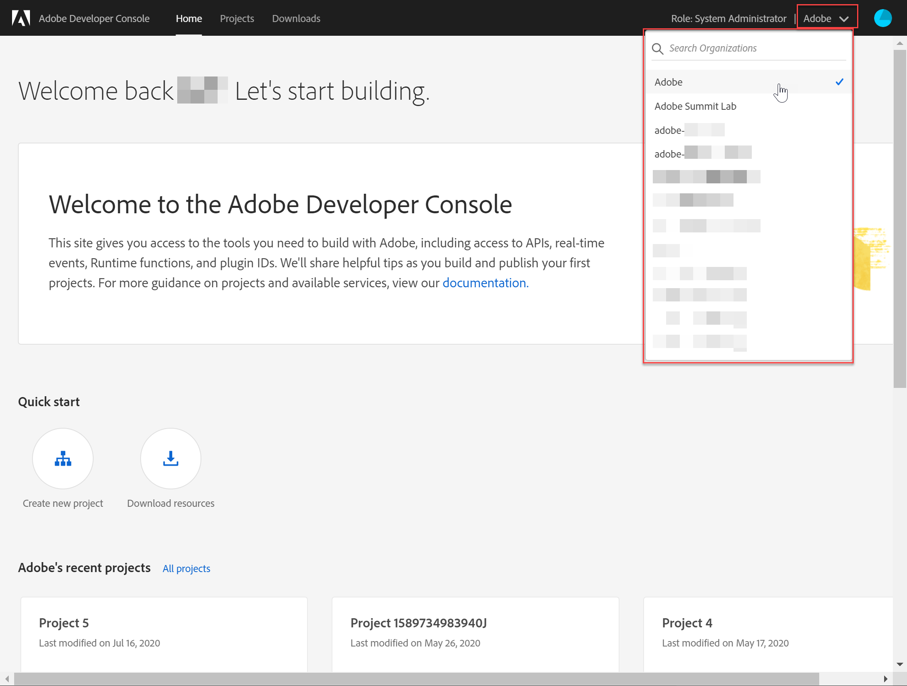
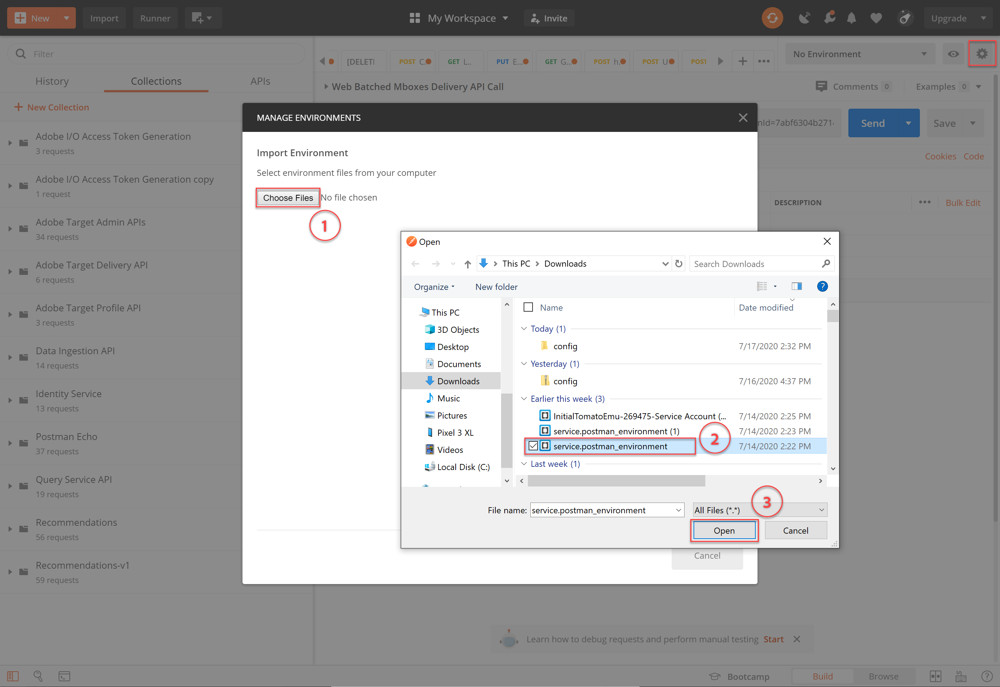
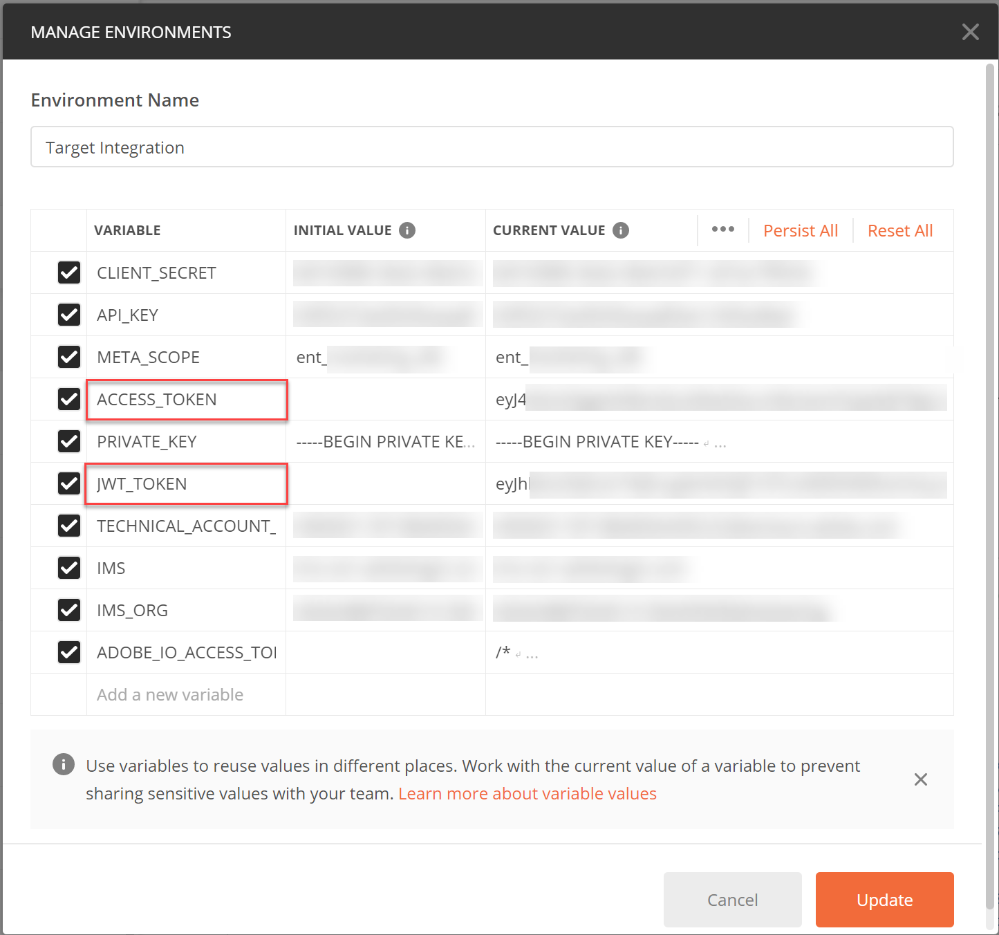
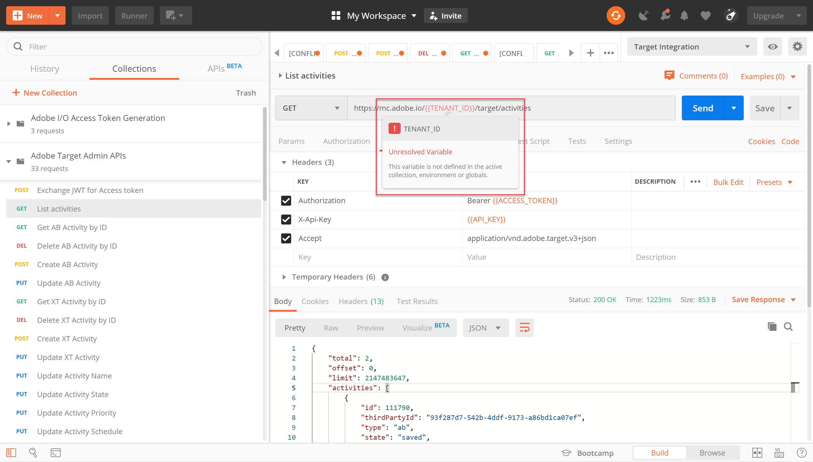

# 인증 구성

관리 API를 비롯한 Adobe Target 관리 API는 [!DNL Recommendations] 인증으로 보호되므로 권한이 있는 사용자만 Adobe Target에 액세스할 수 있습니다. Adobe 개발자 콘솔을 [사용하여 모든 Adobe Experience Cloud 솔루션에 대해 이 인증을 관리할 수](https://console.adobe.io/) [!DNL Target]있습니다.

이 단원에서는 Adobe Target API와 성공적으로 상호 작용하는 데 필요한 인증 토큰을 생성하는 데 필요한 예비 단계를 안내합니다. 다음 섹션에서 다음을 수행합니다.

1. Adobe 개발자 콘솔에서 프로젝트(이전의 통합이라고 함)를 만듭니다.
2. 프로젝트 세부 사항을 Postman으로 내보냅니다.
3. 베어러 액세스 토큰을 생성합니다.
4. 베어러 액세스 토큰을 테스트합니다.

## 전제 조건

| 리소스 | 세부 사항 |
| --- | --- |
| 포스트맨 | 이러한 단계를 성공적으로 완료하려면 운영 체제용 [Postman 앱을](https://www.postman.com/downloads/) 다운로드하십시오. Postman basic은 계정 생성으로 무료입니다. 일반적으로 Adobe Target API를 사용하기 위해 필요하지 않지만, Postman은 API 워크플로우를 보다 쉽게 만들고, Adobe Target은 API를 실행하고 작동 방식을 학습하는 데 도움이 되는 여러 Postman 컬렉션을 제공합니다. 이 자습서의 나머지 부분에서는 Postman에 대한 작업 지식을 가정합니다. 도움이 필요한 경우 [포스트맨 문서를 참조하십시오](https://learning.getpostman.com/). |
| 참조 | 이 자습서의 나머지 부분에서는 다음 리소스에 대해 잘 알고 있다고 가정합니다.<UL><li>[Adobe I/O Github](https://github.com/adobeio)</li><li>[Target Adobe I/O 설명서](https://developers.adobetarget.com/api/#introduction)</li><li>[Recommendations API 설명서](https://developers.adobetarget.com/api/recommendations/)</li></ul> |

## Adobe I/O 프로젝트 만들기

이 섹션에서는 Adobe 개발자 콘솔에 액세스하고 프로젝트를 만듭니다 [!DNL Adobe Target]. 자세한 내용은 프로젝트 [설명서를 참조하십시오](https://www.adobe.io/apis/experienceplatform/console/docs.html#!AdobeDocs/adobeio-console/master/projects.md).

<!--1. Generate your private key and public certificate, per the [documentation on authentication](https://www.adobe.io/authentication/auth-methods.html#!AdobeDocs/adobeio-auth/master/JWT/JWTCertificate.md). //<!--as described in **Step 1** of [How to set up Adobe IO: Authentication - Step by Step](https://helpx.adobe.com/marketing-cloud-core/kb/adobe-io-authentication-step-by-step.html). After completing Step 1, return to this tutorial and resume with Step 2, below. // The outcome of this step should be the creation of a `private.key` file and a `certificate_pub.crt` file. Return to this tutorial once you have generated these two files.-->

1. Adobe Admin Console에서 [Adobe 사용자](https://adminconsole.adobe.com/)계정에 제품 관리자 [및](https://helpx.adobe.com/enterprise/using/admin-roles.html) 개발자 [수준 액세스 권한이 모두 부여되었는지](https://helpx.adobe.com/enterprise/using/manage-developers.html) 확인합니다 [!DNL Target].

2. Adobe 개발자 [콘솔에서](https://console.adobe.io/)이 통합을 만들 Experience Cloud 조직을 선택합니다. (단일 Experience Cloud 조직에만 액세스할 수 있을 수 있습니다.)

   

3. Click **[!UICONTROL Create new project]**.

   

4. Adobe 서비스 및 제품에 액세스하려면 **[!UICONTROL API]** 추가를 클릭하여 프로젝트에 REST API를 추가합니다.

   

5. 통합할 Adobe 서비스 **[!DNL Adobe Target]** 로 선택합니다. 나타나는 **[!UICONTROL 다음]** 단추를 클릭합니다.

   

6. 공개 및 개인 키를 Target용으로 만드는 서비스 계정 통합에 연결할 옵션을 선택합니다. 이 자습서에 대해 **[!UICONTROL 옵션 1: 키 쌍을]** 생성하고 키 쌍 **[!UICONTROL 생성을 클릭합니다]**.
   

7. 결과를 확인하십시오! 지침에 따라 개인 키가 포함된 자동 다운로드 구성 파일(`config`)을 메모해 두십시오. **[!UICONTROL 다음]**을 클릭합니다.
   
8. 파일 시스템에서 이전 단계에서 생성된 압축 구성 파일 `config`의 위치를 확인합니다. 이 `config` 파일에는 나중에 필요한 개인 키가 포함되어 있습니다. 파일 시스템 내의 정확한 위치는 여기에 표시된 위치와 다를 수 있습니다.
   
9. Adobe 개발자 콘솔에서 사용 중인 속성에 해당하는 [제품](https://helpx.adobe.com/enterprise/using/manage-products-and-profiles.html) 프로필을 선택합니다 [!DNL Recommendations]. 속성을 사용하지 않는 경우 기본 작업 공간 옵션을 선택합니다. 구성된 **[!UICONTROL API 저장을 클릭합니다]**.
   

10. 통합 **[!UICONTROL 만들기를 클릭합니다]**. API가 성공적으로 구성되었다는 임시 메시지를 수신해야 합니다.

11. 마지막으로 프로젝트의 이름을 원본보다 의미 있는 이름으로 변경합니다 `Project 1`. 이렇게 하려면 표시된 대로 탐색 경로를 사용하여 프로젝트로 이동하고 프로젝트 **[!UICONTROL 편집을]** 클릭하여 **프로젝트 편집 모달에 액세스한 다음 프로젝트이름을 변경합니다.

>[!NOTE]
> 
>이 자습서에서는 프로젝트 이름을 &quot;Target 통합&quot;으로 지정합니다. Adobe Target 이상의 용도로 프로젝트를 사용하는 경우 해당 프로젝트에 이름을 지정할 수 있습니다. 예를 들어 Adobe Experience Cloud의 다른 솔루션과 함께 사용될 수 있으므로 &quot;Adobe API&quot; 또는 &quot;Experience Cloud APIs&quot;로 이름을 지정할 수 있습니다.

## 프로젝트 세부 사항 내보내기

액세스 시 사용할 수 있는 Adobe 프로젝트가 있으므로 Adobe API 요청과 함께 해당 프로젝트의 세부 정보를 보내야 [!DNL Target]합니다. 여러 API를 비롯한 여러 Adobe API와 상호 작용하려면 이러한 세부 사항이 [!DNL Target] 필요합니다. 예를 들어 통합 세부 정보에는 관리 API에 필요한 인증 및 인증 정보가 [!DNL Target] 포함됩니다. 따라서 Postman에서 API를 사용하려면 이러한 세부 사항을 Postman으로 가져와야 합니다.

Postman에서 프로젝트의 세부 사항을 지정하는 방법에는 여러 가지가 있지만, 이 섹션에서는 사전 제작된 일부 기능과 컬렉션을 활용할 수 있습니다. 먼저(이 섹션에서) 통합 세부 사항을 Postman 환경으로 내보냅니다. 다음 섹션에서 필요한 Adobe 리소스에 액세스할 수 있도록 베어러 액세스 토큰을 생성합니다.

>[!NOTE]
>
>Experience Cloud 솔루션에 적용되는 비디오 지침(예: Experience Platform API와 함께 Postman [!DNL Target]사용)을 참조하십시오 . 다음 섹션은 [!DNL Target] API와 관련이 있습니다.
>
> 1. Postman으로 Adobe I/O 통합 세부 정보 내보내기
> 2. Postman을 사용하여 액세스 토큰 생성

>
> 
이러한 단계는 아래에서도 제공됩니다.

1. 여전히 [Adobe 개발자 콘솔에](https://console.adobe.io/)있는 경우 새 프로젝트의 JWT( **[!UICONTROL 서비스 계정)]** 인증서를 볼 수 있습니다. 표시된 대로 왼쪽 탐색 또는 **[!UICONTROL 자격 증명]** 섹션을 사용하십시오.
   의 **[!UICONTROL 자격 증명 세부]**&#x200B;사항 **은 공개**&#x200B;키, **클라이언트 ID**및 기타 서비스 계정과 관련된 정보를 볼 수 있다는 것을 참고하십시오.
   
2. 을 클릭하여 **[!UICONTROL Adobe Target]** API에 대한 정보를 탐색합니다. 표시된 대로 왼쪽 탐색 또는 **[!UICONTROL 연결된 제품 및 서비스]** 섹션을 사용하십시오.
   
3. 포스트만 **[!UICONTROL 다운로드]** > **[!UICONTROL 서비스 계정(JWT)]** 을 클릭하여 포스트만 환경에 대한 인증 정보를 캡처하는 JSON 파일을 만듭니다.
   파일 시스템에 있는 JSON 파일을 메모해 둡니다.
   
4. Postman에서 톱니바퀴 아이콘을 클릭하여 환경을 관리하고 **가져오기를** 클릭하여 JSON 파일(환경)을 가져옵니다.
   
5. 파일을 선택하고 [열기]를 **클릭합니다**.
   
6. Postman **환경** 관리 모달에서 새로 가져온 환경의 이름을 클릭하여 검사합니다. (여기에 표시된 환경 이름과 다를 수 있습니다. 원하는 대로 이름을 편집합니다. Adobe 프로젝트 이름과 일치할 필요는 없습니다.)
   
7. 참고 `CLIENT_SECRET` 및 `API_KEY` (다른 변수와 함께)에는 Adobe 개발자 콘솔에서 정의된 대로 통합에서 생성된 값이 미리 채워집니다. (Postman `CLIENT_SECRET` 변수는 개발자 콘솔에 표시된 `CLIENT SECRET` Adobe 자격 증명과 일치해야 하고, Postman `API_KEY` 의 경우 개발자 콘솔 `CLIENT ID` 의 자격 증명과 일치해야 합니다.) 대조적으로, 참고, `PRIVATE_KEY``JWT_TOKEN`및 `ACCESS_TOKEN` 비어 있습니다. 먼저 `PRIVATE_KEY` 가치 제공
   

   >[!SURPRISE]
   >
   >퀴즈! 개인 키가 어디 있는지 기억나세요?
   >맞습니다. Adobe 개발자 콘솔에서 이전에 다운로드한 `config` 파일에 있습니다.

8. 파일 시스템에서 `config` 파일을 열고 `private` 키 파일을 엽니다.
   
9. 키 파일의 전체 내용을 선택하고 `private` 복사합니다.
   
10. Postman에서 개인 키 값을 **INITIAL VALUE** 및 **CURRENT VALUE** 필드에 붙여넣습니다.
   
11. 업데이트 **[!UICONTROL 를]**&#x200B;클릭하고 환경 양식을 닫습니다.

## 베어러 액세스 토큰 생성

이 섹션에서는 Adobe Target API와의 상호 작용을 인증하는 데 필요한 베어러 액세스 토큰을 생성합니다. 모바일 액세스 토큰을 생성하려면 통합 세부 사항(이전 섹션에 설정됨)을 [Adobe Identity Management 서비스(IMS)로 보내야 합니다](https://www.adobe.io/authentication/auth-methods.html#!AdobeDocs/adobeio-auth/master/AuthenticationOverview/AuthenticationGuide.md). 이 방법에는 몇 가지 다른 방법이 있지만 이 자습서에서는 IMS API에 정확한 POST 요청을 빌드합니다. 농담이에요 이 튜토리얼에서는 프로세스를 직접적이고 손쉽게 진행할 수 있도록 미리 만들어진 IMS 호출이 포함된 Postman 컬렉션을 활용하고 있습니다. 컬렉션을 가져오면 필요할 때마다 다시 사용할 수 있으므로 Adobe Target뿐만 아니라 다른 Adobe API에 대해서도 새로운 토큰을 생성할 수 있습니다.

1. Adobe Identity Management 서비스 [API 샘플 호출로 이동합니다](https://github.com/adobe/experience-platform-postman-samples/tree/master/apis/ims).
   
2. Adobe **I/O 액세스 토큰 생성 Postman 컬렉션을 클릭합니다**.
   
3. Raw를 클릭한 다음 결과 JSON을 **클립보드로**복사하여 이 컬렉션에 대한 원시 JSON을 가져올 수 있습니다. (또는 원시 JSON을 .json 파일로 저장할 수 있습니다.)
   
4. Postman에서, 클립보드에 있는 원시 JSON을 붙여넣고 제출하여 컬렉션을 가져옵니다. 또는 저장한 .json 파일을 업로드할 수 있습니다. **계속**을 클릭합니다.
   
5. IMS **[!UICONTROL 를 선택합니다. JWT Adobe I/O 액세스 토큰 생성 Postman 컬렉션의 사용자 토큰]** 요청을 통해 + 인증 **을 생성하고, 환경이 선택되었는지 확인하고 전송을** 클릭하여 토큰을 생성합니다.

   

   >[!NOTE]
   >
   >이 베어러 액세스 토큰은 24시간 동안 유효합니다. 새 토큰을 생성해야 할 때마다 요청을 다시 전송합니다.

6. 환경 관리 양식을 다시 열고 환경을 선택하십시오.
   
7. 이제 `ACCESS_TOKEN` 및 `JWT_TOKEN` 값이 채워집니다.
   

>[!NOTE]
>
>Q: JWT(JSON Web Token) 및 전달자 액세스 토큰을 생성하려면 Adobe I/O 액세스 토큰 생성 포스트만 컬렉션을 사용해야 합니까?
>
>A: 안돼! Adobe I/O 액세스 토큰 생성 포스트맨 컬렉션은 Postman에서 JWT 및 전달자 액세스 토큰을 보다 쉽게 생성할 수 있는 편리한 기능으로 제공됩니다. 또는 Adobe 개발자 콘솔 내의 기능을 사용하여 베어러 액세스 토큰을 수동으로 생성할 수 있습니다.

## 베어러 액세스 토큰 테스트

이 연습에서는 [!DNL Target] 계정에서 활동 목록을 검색하는 API 요청을 전송하여 새로운 베어러 액세스 토큰을 사용합니다. 성공적인 응답은 Adobe 프로젝트 및 인증이 API를 사용하기 위해 예상대로 작동함을 나타냅니다.

1. Adobe Target [관리 APIs Postman Collection을 가져옵니다](https://developers.adobetarget.com/api/#admin-postman-collection). Postman에서 컬렉션을 가져올 때까지 모든 프롬프트에 따릅니다.
   
1. 컬렉션을 확장하고 목록 활동 **[!UICONTROL 요청을]** 메모합니다.
   
1. 초기에 해결되지 않은 변수 `{{access_token}}` 는 다음과 같습니다. 다음과 같은 여러 가지 방법으로 이 문제를 해결할 수 있습니다. 예를 들어 새 컬렉션 변수를 정의할 수 `{{access_token}}`있지만 이 자습서에서는 이전에 사용하던 Postman 환경을 활용하도록 API 요청을 변경합니다. 이렇게 하면 환경이 Adobe API에 공통되는 모든 변수를 하나의 일관된 통합으로 계속 사용할 수 있습니다.
   
1. 바꿀 내용 `{{access_token}}` 을 입력합니다 `{{ACCESS_TOKEN}}`.
   
1. 바꿀 내용 `{{api_key}}` 을 입력합니다 `{{API_KEY}}`.
   
1. 바꿀 내용 `{{tenant}}` 을 입력합니다 `{{TENANT_ID}}`. 메모 `{{TENANT_ID}}` 는 아직 인식되지 않습니다.
   
1. 환경 관리 양식을 열고 환경을 선택합니다.
   
1. 새 `{{TENANT_ID}}` 환경 변수를 추가하려면 입력합니다. 테넌트 ID 값을 복사하여 새 **환경 변수의** 초기 값 **및** 현재 값 `TENANT_ID` 필드에 붙여넣을 수있습니다.
   
   >[!NOTE]
   >
   >테넌트 ID가 사용자와 [!DNL Target] `clientcode`다릅니다. 로그인하면 테넌트 ID가 URL에 있습니다 [!DNL Target]. 테넌트 ID를 얻으려면 로그인하고 [!DNL Adobe Experience Cloud]연 [!DNL Target]다음 [!DNL Target] 카드를 클릭합니다. URL 하위 도메인에 명시된 대로 테넌트 ID 값을 사용합니다.
   >
   >예를 들어 Adobe Target에 로그인할 때 URL이
   ><https://mycompany.experiencecloud.adobe.com/...>
   >그러면 테넌트 ID가 &quot;mycompany&quot;입니다.

1. 올바른 환경을 선택했는지 확인한 후 요청을 보냅니다. 활동 목록이 포함된 응답을 받아야 합니다.
   

축하합니다! 이제 Adobe 인증을 확인했으므로 Adobe Target API(및 다른 Adobe API)와 상호 작용하는 데 사용할 수 있습니다. 예를 들어 Recommendations API를 [사용하여](https://docs.adobe.com/content/help/en/target-learn/recommendations-api-tutorial/recs-api-overview.html) 권장 사항을 만들거나 관리할 수 있습니다.
