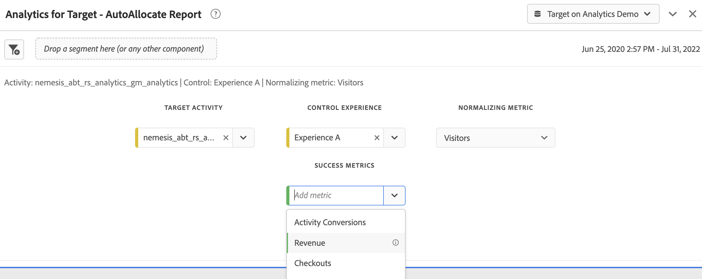

# 용 Analysis Workspace에서 A4T 보고서 설정 [!DNL Auto-Allocate] 활동

An [!DNL Auto-Allocate] 활동은 둘 이상의 경험에서 승자를 식별하고, 테스트가 계속 실행되고 학습되는 동안 더 많은 트래픽을 승자에게 자동으로 재할당합니다. 용 A4T(Target 분석) 통합 [!DNL Auto-Allocate] Adobe Analytics에서 보고 데이터를 볼 수 있고, Adobe Analytics에 정의된 사용자 지정 이벤트 또는 지표에 대해서도 최적화할 수 있습니다.

Adobe Analytics Analysis Workspace에서 풍부한 분석 기능을 사용할 수 있지만, 기본값을 몇 가지 수정했습니다 **[!UICONTROL Target 분석]** 패널을 올바르게 해석하려면 [!DNL Auto-Allocate] 활동, 즉 [최적화 기준](https://experienceleague.adobe.com/docs/target/using/integrate/a4t/a4t-at-aa.html?lang=en#supported).

이 자습서에서는 분석을 위한 권장 수정 사항을 안내합니다 [!DNL Auto-Allocate] 활동 을 만들 수 있습니다. 주요 개념은 다음과 같습니다.

* 방문자는 항상 [!DNL Auto-Allocate] 활동.
* 지표가 Adobe Analytics 지표인 경우 전환율에 대한 적절한 분자는 활동 설정 중에 선택한 최적화 기준의 유형에 따라 달라집니다.
   * &quot;고유 방문자 전환율 최대화&quot; 최적화 기준에는 분자가 지표의 양수 값을 가진 고유 방문자 수의 카운트인 전환율이 있습니다.
   * 방문자당 지표 값 최대화*에는 분자 가 Adobe Analytics의 일반 지표 값인 전환율이 있습니다. 기본적으로 **[!UICONTROL Target 분석]** 패널에 표시되어야 합니다.
* 최적화 지표가 Target 정의 전환 지표인 경우, 기본값은 입니다 **[!UICONTROL Target 분석]** 작업 공간의 패널에서 패널 구성을 처리합니다.
* Workspace에 표시되는 신뢰도 번호는 [자동 할당에서 사용하는 보다 보수적인 통계](https://experienceleague.adobe.com/docs/target/using/activities/auto-allocate/automated-traffic-allocation.html?lang=en#section_98388996F0584E15BF3A99C57EEB7629)와 마찬가지로 을 제거해야 합니다.

## 용 A4T 만들기 [!DNL Auto-Allocate] 작업 공간의 패널

에 대한 A4T를 만들려면 [!DNL Auto-Allocate] 보고서 시작 **[!UICONTROL Target 분석]** 아래와 같이 Workspace의 패널을 구성합니다. 그런 다음 다음을 선택합니다.

1. **[!UICONTROL 제어 경험]**: 원하는 경험을 선택할 수 있습니다
2. **[!UICONTROL 지표 정규화]**: 방문자 선택 - 자동 할당은 항상 고유 방문자별로 전환율을 정규화합니다.
3. **[!UICONTROL 성공 지표 를 참조하십시오]**: 활동을 만들 때 사용한 것과 동일한 지표를 선택합니다. Target이 정의된 전환 지표인 경우 **활동 전환**. 그렇지 않은 경우 사용한 Adobe Analytics 지표를 선택합니다.

*그림 1: 용 Analytics for Target 패널 설정 [!DNL Auto-Allocate] 활동.*

>[!NOTE]
>
> 또한 사전 빌드된 **[!UICONTROL Target 분석]** Adobe Target의 보고서 화면에서 링크를 클릭하면 표시됩니다.

## Target 전환 지표 또는 Analytics 지표를 &quot;방문자당 지표 값 최대화&quot; 최적화 기준으로 사용

기본 A4T 패널 핸들 [!DNL Auto-Allocate] 목표 지표가 Target 전환이거나 최적화 기준이 &quot;방문자당 지표 값 최대화&quot;인 Analytics 지표인 활동.

이 패널의 한 예는 매출 지표에 대해 보여줍니다. 이 지표에서는 활동 생성 시 최적화 기준으로 &quot;방문자당 지표 값 최대화&quot;가 선택되었습니다. 앞서 언급했듯이 [!DNL Auto-Allocate] 에서는 보다 보수적인 신뢰 계산을 사용하는데, **[!UICONTROL Target 분석]** 패널. 따라서 신뢰도 지표와 관련된 하위 및 상위 상승도 지표를 제거하는 것이 좋습니다.

*그림 2: 에 대한 권장 보고서 [!DNL Auto-Allocate] analytics 지표가 있는 활동 방문자당 지표 값을 최대화합니다 최적화 기준입니다. 이러한 유형의 지표와 Target 정의된 전환 지표의 경우, 기본값은 입니다&#x200B;**[!UICONTROL Target 분석]**작업 공간의 패널을 사용할 수 있습니다.*

## &quot;고유 방문자 전환율 최대화&quot; 최적화 기준을 사용한 Analytics 지표

Adobe Analytics 지표를 의 최적화 기준과 함께 사용하는 경우 *고유 방문자 전환율 최대화*, 기본 **[!UICONTROL Target 분석]** 작업 공간의 패널을 수정해야 합니다.

이제 성공 지표는 전환 지표가 긍정적이었던 고유 방문자 수입니다. 이 작업은 양의 지표 값이 있는 히트로 필터링하는 세그먼트를 만들어 수행할 수 있습니다. 이 세그먼트를 다음과 같이 만듭니다.

1. 을(를) 선택합니다 **구성 요소** > **세그먼트 만들기** 옵션 을 클릭합니다.
1. 활동 생성 시 사용된 지표를 왼쪽 패널에서 **정의** 상자에 표시되지 않습니다.
1. 지표의 값을 선택합니다 **보다 큼** 0의 숫자 값입니다.
1. 에서 **포함** 드롭다운, 선택 **방문자 수**
1. 세그먼트에 적절한 이름을 지정합니다

아래 그림에서 세그먼트 만들기의 예는 수입을 긍정적인 방문자를 선택하는 것입니다.

*그림 3: 최적화 기준이 고유 방문자 전환율을 최대화하는 것과 동일한 Adobe Analytics 지표에 대한 세그먼트 생성. 이 예에서 지표는 매출이고 최적화 목표는 긍정적인 매출으로 방문자 수를 최대화하는 것입니다.*

적절한 세그먼트가 만들어지면, 기본값은  **[!UICONTROL Target 분석]** 작업 공간의 패널을 수정할 수 있습니다.

1. 초 추가 **고유 방문자 수** 기존 방문자 지표 열과 함께 지표입니다
2. 방금 만든 세그먼트를 첫 번째 열 아래로 끌어서 그림 4와 유사한 패널을 만듭니다. 차이점에 주목하십시오. 긍정적인 수입을 가진 고유 방문자 수는 각 경험에 할당된 총 고유 방문자 수의 일부입니다.
   
   *그림 4: 새로 만든 세그먼트별로 고유 방문자 필터링*
3. 전환율은 [빠르게 계산](https://experienceleague.adobe.com/docs/analytics-learn/tutorials/components/calculated-metrics/quick-calculated-metrics-in-analysis-workspace.html?lang=en) 첫 번째 열과 두 번째 열을 모두 강조 표시하고 마우스 오른쪽 단추를 클릭하고 선택 **선택 항목에서 지표 만들기** > **나누기**. 기본 전환율은 아래 이미지와 같이 제거하고 이 새 계산된 지표로 대체해야 합니다. 새로 만든 계산된 지표를 편집하여 **형식** > **Percent** 표시된 대로 최대 2개의 소수 자리를 사용할 수 있습니다.
   

   *그림 4: 두 개의 분리된 수입 전환 지표에 대한 전환율을 보여주는 최종 자동 할당 패널*

## 결론

위의 단계는 올바르게 구성하는 방법을 보여줍니다 [!DNL Workspace] 자동 할당 보고 데이터를 표시하려면 다음을 수행하십시오. 요약하려면 다음을 수행하십시오.

* 지표가 Target 정의 전환 지표이거나 최적화 기준이 있는 Adobe Analytics 지표인 경우 *방문자당 지표 값 최대화*&#x200B;를 채울 때는 방문자로 구성된 기본 작업 공간 패널을 정규화 지표로 사용해야 합니다.
* 지표가 최적화 기준이 &quot;고유 방문자 전환율 최대화&quot;인 Adobe Analytics 지표인 경우 지표가 긍정인 방문자의 분수로 정의된 전환율을 사용해야 합니다. 이 작업은 고유한 방문자 지표를 필터링하는 해당 세그먼트를 만들어 수행됩니다.
