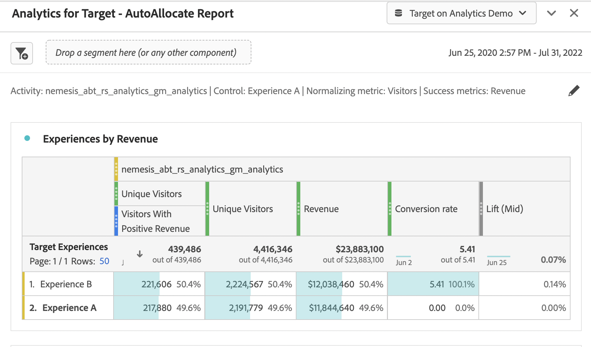

# 에서 A4T 보고서 설정 [!DNL Analysis Workspace] 대상 [!DNL Auto-Allocate] 활동

An [!DNL Auto-Allocate] 활동은 둘 이상의 경험에서 승자를 식별하고, 테스트가 계속 실행되고 학습되는 동안 트래픽을 승자에게 자동으로 재할당합니다. 다음 [!UICONTROL Target 분석] 용 (A4T) 통합 [!UICONTROL 자동 할당] 에서 보고 데이터를 볼 수 있습니다. [!DNL Adobe Analytics]및에 정의된 사용자 지정 이벤트 또는 지표에 최적화할 수도 있습니다. [!DNL Analytics].

다양한 분석 기능은에서 사용할 수 있습니다 [!DNL Adobe Analytics] [!DNL Analysis Workspace], 기본값에 대한 몇 가지 수정 사항 **[!UICONTROL Target 분석]** 패널을 올바르게 해석해야 할 수 있음 [!DNL Auto-Allocate] 활동, 의 뉘앙스로 인해 [최적화 지표 기준](https://experienceleague.adobe.com/docs/target/using/integrate/a4t/a4t-at-aa.html#supported){target=_blank}.

이 자습서에서는 분석을 위한 권장 수정 사항을 안내합니다 [!DNL Auto-Allocate] 의 활동 [!DNL Analysis Workspace]. 주요 개념은 다음과 같습니다.

* [!UICONTROL 방문자 수] 는 항상 의 표준화 지표로 사용해야 합니다. [!DNL Auto-Allocate] 활동.
* 지표가 다음과 같은 경우 [!DNL Adobe Analytics] 지표, 전환율 계산은 활동 설정 중에 정의된 최적화 기준 유형에 따라 달라집니다.
   * &quot;방문자당 지표 값 최대화&quot;: 전환율 분자는 의 일반 지표 값입니다. [!DNL Adobe Analytics] (기본적으로 다음에서 제공됨: [!UICONTROL Target 분석] 패널 A[!DNL nalysis Workspace]).
      * 의미는 방문자당 전환 수를 최대화합니다(&quot;방문자당 각각 카운트&quot;).
      * 이 메서드는에 표시되는 전환율과 일치시키기 위해 추가 세그먼트를 필요로 하지 않습니다. [!DNL Target] UI.
   * &quot;고유 방문자 전환율 최대화&quot;: 전환율 분자는 지표가 양수 값을 갖는 고유 방문자 수입니다.
      * 이것은 다음을 의미합니다. 전환하는 방문자 수를 최대화합니다(&quot;방문자당 한 번 카운트).
      * 이 메서드 *다음과 같음* 보고서에 표시된 전환율과 일치하도록 보고에서 추가 세그먼트를 생성해야 함 [!DNL Target] UI.

* 최적화 지표가 [!DNL Target] 정의된 전환 지표, 기본값 **[!UICONTROL Target 분석]** 패널 위치 [!DNL Analysis Workspace] 는 패널 구성을 처리합니다.
* 모든 항목 [!UICONTROL 자동 할당] 다음 날짜 이전에 만들어진 활동 [!DNL Target Standard/Premium] 23.3.1 릴리스 (2023년 3월 30일) [!DNL Analytics Workspace] 및 [!DNL Target] 에 대해 동일한 값 표시 [!UICONTROL 신뢰도].

  모든 항목 [!UICONTROL 자동 할당] 에 표시되는 신뢰 구간 값인 2023년 3월 30일 이후에 생성된 활동 [!DNL Analysis Workspace] 을(를) 반영하지 않음 [다음에서 사용하는 더 보수적인 통계: [!UICONTROL 자동 할당]](https://experienceleague.adobe.com/docs/target/using/activities/auto-allocate/automated-traffic-allocation.html#section_98388996F0584E15BF3A99C57EEB7629){target=_blank} 다음 활동이 있는 경우: *모두* 다음 조건 중:

   * [!DNL Analytics] 보고 소스 (A4T) 로
   * [!DNL Analytics] 최적화 지표

  신뢰도 지표는 A4T 패널에서 제거해야 합니다. 대신,에서 이 값을 참조합니다. [!DNL Target] 보고.

## 용 A4T 만들기 [!DNL Auto-Allocate] 패널 위치 [!DNL Analysis Workspace]

용 A4T 패널을 만들려면 [!DNL Auto-Allocate] 보고서 시작 **[!UICONTROL Target 분석]** 패널 위치 [!DNL Analysis Workspace]아래에 표시된 대로 를 클릭합니다. 그런 다음 다음을 선택합니다.

1. **[!UICONTROL 제어 경험]**: 모든 경험을 선택할 수 있습니다.
1. **[!UICONTROL 지표 표준화]**: 방문자 선택(기본적으로 방문자는 A4T 패널에 포함됨). [!DNL Auto-Allocate] 항상 고유 방문자에 의한 전환율을 표준화합니다.
1. **[!UICONTROL 성공 지표]**: 활동 생성 중에 사용한 것과 동일한 지표를 선택합니다. 이 항목이 [!DNL Target] 정의된 전환 지표, 선택 **활동 전환**. 그렇지 않으면 [!DNL Adobe Analytics] 사용한 지표입니다.

![[!UICONTROL Target 분석] 패널 설정 [!DNL Auto-Allocate] 활동.](assets/AAFigure1.png)

*그림 1: [!UICONTROL Target 분석] 패널 설정 [!DNL Auto-Allocate] 활동.*

사전 설치된 시스템에 도착할 수도 있습니다 **[!UICONTROL Target 분석]** 패널 의 보고서 화면에서 링크를 클릭하는 경우 [!DNL Adobe Target].

## [!DNL Target] [!UICONTROL 전환] 지표 또는 [!DNL Analytics] &quot;방문자당 지표 값 최대화&quot; 최적화 기준이 있는 지표

목표 지표가 다음 중 하나일 때:

* Target 전환 지표
* 최적화 기준이 &quot;방문자당 지표 값 최대화&quot;인 Analytics 지표

기본 A4T 패널은 보고서를 자동으로 구성합니다.

이 패널의 한 가지 예는 [!UICONTROL 매출] 활동 생성 시 최적화 기준으로 &quot;방문자당 지표 값 최대화&quot;가 선택된 지표입니다. 앞에서 언급했듯이 [!DNL Auto-Allocate] 에서는 에 사용된 것보다 더 보수적인 신뢰도 계산을 사용합니다. **[!UICONTROL Target 분석]** 패널. Adobe은 A4T 패널과 관련 하위 및 상위 리프트 지표에서 신뢰 지표를 제거할 것을 권장합니다. 대신 의 신뢰도 값을 참조하십시오. [!DNL Target] 보고.

>[!NOTE]
>
>A4T 보고의 신뢰도 값은 보다 덜 보수적입니다. [!DNL Target] 을(를) 보고하면 의 승자를 조기에 나타낼 수 있습니다. [!UICONTROL 자동 할당] 활동.

![[!UICONTROL Analytics for Target - 자동 할당 보고서] 패널](assets/AAFigure2.png)

*그림 2: 추천 보고서 [!DNL Auto-Allocate] 이 있는 활동 [!DNL Analytics] 지표 &quot;방문자당 지표 값 최대화&quot; 최적화 기준. 이러한 유형의 지표 및 [!DNL Target] 정의된 전환 지표, 기본값&#x200B;**[!UICONTROL Target 분석]**패널 위치 [!DNL Analysis Workspace] 를 사용할 수 있습니다.*

## [!DNL Analytics] &quot;고유 방문자 전환율 최대화&quot; 최적화 기준이 있는 지표

최적화 기준 &quot;고유 방문자 전환율 최대화&quot;는 지표 값이 양수인 방문자 수를 의미합니다. 예를 들어 전환율이 매출로 정의된 경우 &quot;고유 방문자 전환율 최대화&quot; 기준은 매출이 0보다 큰 고유 방문자 수에 최적화됩니다. 즉, 이 기준은 매출 자체의 가치보다 매출을 생성하는 방문자 수를 최대화합니다.

>[!NOTE]
>
>여기에서 참조한 전환율은 클릭, 노출 등과 같은 주문 이외의 작업을 의미할 수 있습니다. 이러한 경우 기준은 여전히 각각 페이지를 클릭하거나 본 방문자의 수를 최대화하는 것입니다.

다음 [!DNL Analytics for Target] 패널 위치 [!DNL Analysis Workspace] 이 최적화 기준이 과 함께 사용되는 경우 수정해야 합니다. [!DNL Adobe Analytics] 지표.

이 최적화 기준이 사용되는 경우 성공 지표는 전환 지표가 양수인 고유 방문자 수입니다. 따라서 이 값을 보려면 지표에 대해 양의 값이 있는 히트를 필터링하는 새 세그먼트를 만들어야 합니다.

다음과 같이 이 세그먼트를 만듭니다.

1. 다음 항목 선택 **[!UICONTROL 구성 요소]** > **[!UICONTROL 세그먼트 만들기]** 의 옵션 [!DNL Analysis Workspace] 도구 모음
1. 왼쪽 패널에서 활동 만들기 시간에 사용되는 지표를 로 드래그합니다. **[!UICONTROL 정의]** 세그먼트의 상자입니다.
1. 다음 지표의 값을 선택합니다. **보다 큼** 숫자 값 0입니다.
1. 다음에서 **[!UICONTROL 포함]** 드롭다운, 선택 **[!UICONTROL 방문자 수]**.
1. 세그먼트에 적절한 이름을 지정합니다.

세그먼트 작성의 예는 아래 그림과 같으며, 여기에서 성공 지표는 다음과 같습니다. [!UICONTROL 매출이 긍정적인 방문자].

![[!UICONTROL 매출이 긍정적인 방문자] 세그먼트 위치 [!DNL Analysis Workspace]](assets/AAFigure3.png)

*그림 3: 세그먼트 생성 [!DNL Adobe Analytics] 최적화 기준이 &quot;&quot;와 동일한 지표[!UICONTROL 고유 방문자 전환율 최대화].&quot; 이 예에서 지표는 다음과 같습니다. [!UICONTROL 매출], 그리고 최적화 목표는 긍정적인 수익이 있는 방문자 수를 최대화하는 것입니다.*

해당 세그먼트가 만들어지면 기본값을 수정할 수 있습니다  **[!UICONTROL Target 분석]** 패널 위치 [!DNL Analysis Workspace] 을 클릭하여 최적화 기준 값을 볼 수 있습니다. 이 작업은 다음 작업을 통해 수행됩니다.

1. 초 추가 **고유 방문자 수** 기존 지표 [!UICONTROL 방문자 수] 지표 열입니다.
2. 새로 만든 세그먼트를 첫 번째 열 아래로 드래그하여 그림 4와 유사한 패널을 만듭니다. 열의 값 차이에 주목하십시오. 양수 수익을 갖는 고유 방문자 수는 각 경험에 할당된 총 고유 방문자 수의 일부여야 합니다(아래 참조).

   

   *그림 4: 필터링 [!UICONTROL 고유 방문자 수] 새로 생성된 세그먼트별*

3. 전환율은 다음과 같을 수 있습니다. [빨리 계산됨](https://experienceleague.adobe.com/docs/analytics-learn/tutorials/components/calculated-metrics/quick-calculated-metrics-in-analysis-workspace.html) 첫 번째 열과 두 번째 열을 모두 강조 표시하고 마우스 오른쪽 단추로 클릭한 다음 **[!UICONTROL 선택 항목에서 지표 만들기]** > **[!UICONTROL 나누기]**.

   기본 전환율은 아래 이미지에 표시된 대로 제거하고 이 새 계산된 지표로 대체해야 합니다. 로 표시하기 위해 새로 생성된 계산된 지표를 편집해야 할 수 있습니다. **[!UICONTROL 형식]** > **[!UICONTROL 백분율]** 최대 소수 둘째 자리까지 표시할 수 있습니다.

   

   *그림 5: 최종 [!UICONTROL 자동 할당] 이진화된 매출 전환 지표에 대한 전환율을 보여 주는 패널*

## 요약

이 자습서의 단계에서는 을 올바르게 구성하는 방법을 보여줍니다 [!DNL Analysis Workspace] 표시 [!UICONTROL 자동 할당] 보고 데이터.

요약하려면 다음을 수행하십시오.

* 지표가 인 경우 [!DNL Target] 정의된 전환 지표 또는 [!DNL Adobe Analytics] 최적화 기준이 &quot;방문자당 지표 값 최대화&quot;인 지표, 표준화 지표로 방문자로 구성된 기본 작업 영역 패널을 사용해야 합니다.
* 지표가 다음과 같은 경우 [!DNL Adobe Analytics] 최적화 기준이 &quot;고유 방문자 전환율 최대화&quot;인 지표. 총 방문자에 대해 양의 지표 값을 갖는 방문자의 비율을 결정해야 합니다. 이 작업은 다음을 필터링하는 해당 세그먼트를 생성하여 수행합니다. [!UICONTROL 고유 방문자] 해당 지표에 대해 설명합니다.
