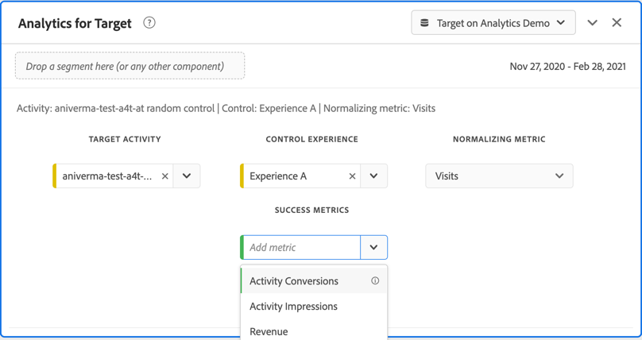

# [!DNL Auto-Target] 활동에 대해 Analysis Workspace에서 A4T 보고서를 설정하는 방법

[!DNL Auto-Target] 활동에 대한 Analytics for Target(A4T) 통합은 Adobe Analytics 목표 지표를 사용하는 동안 Adobe Target의 앙상블 머신 러닝(ML) 알고리즘을 사용하여 프로필, 행동 및 컨텍스트를 기반으로 각 방문자에 대해 최상의 경험을 선택합니다.

Adobe Analytics Analysis Workspace에서 풍부한 분석 기능을 사용할 수 있지만 실험 활동(수동 A/B 및 자동 할당)과 개인화 활동([!DNL Auto-Target])의 차이 때문에 Target ]**패널에 대한 기본**[!UICONTROL  Analytics의 몇 가지 수정이 필요합니다.[!DNL Auto-Target]

이 자습서에서는 다음 주요 개념을 기반으로 하는 작업 공간에서 [!DNL Auto-Target] 활동을 분석하기 위한 권장 수정 사항을 안내합니다.

* **[!UICONTROL Control vs 타깃팅된]** 차원은 제어 경험과 [!DNL Auto-Target] 앙상블 ML 알고리즘에서 제공하는 것을 구분하는 데 사용할 수 있습니다.
* 방문 횟수는 실적의 경험 수준 분류를 볼 때 표준화 지표로 사용해야 합니다. 또한 [Adobe Analytics의 기본 계산 방법에는 사용자가 실제로 활동 컨텐츠](https://experienceleague.adobe.com/docs/target/using/integrate/a4t/a4t-faq/a4t-faq-viewing-reports.html?lang=en#metrics)을(를) 보지 않는 방문이 포함될 수 있지만 이 기본 동작은 적절한 범위 세그먼트를 사용하여 수정할 수 있습니다(아래 세부 사항).
* 정해진 속성 모델에서 &quot;방문 룩백 창&quot;이라고도 하는 방문 확인 범위 속성은 교육 단계 동안 Adobe Target의 ML 모델에서 사용하며, 목표 지표를 분류할 때는 동일한(기본값이 아닌) 속성 모델을 사용해야 합니다.

## 작업 공간에서 [!DNL Auto-Target] 패널에 대한 A4T 만들기

[!DNL Auto-Target] 보고서에 대한 A4T를 만들려면 아래와 같이 작업 공간에서 Target ]**패널에 대한**[!UICONTROL &#x200B;분석으로 시작하거나 자유 형식 테이블로 시작합니다. 그런 다음 다음을 선택합니다.

1. **[!UICONTROL 제어 경험]**:어떤 경험이든 선택할 수 있습니다.그러나 나중에 이 선택 사항을 무시하게 됩니다. [!DNL Auto-Target] 활동의 경우 제어 경험은 (a) 모든 경험들 사이에 임의로 제공되거나, b) 단일 경험을 제공하는 제어 전략입니다(이 선택 사항은 Adobe Target에서 활동 생성 시 수행됨). 선택 (b) - [!DNL Auto-Target] 활동이 특정 경험을 제어로 지정한 경우에도 [!DNL Auto-Target] 활동에 대한 A4T 분석을 위해 이 튜토리얼에 설명된 접근 방식을 따라야 합니다.
2. **[!UICONTROL 표준화 지표]**:방문을 선택합니다.
3. **[!UICONTROL 성공 지표]**:보고할 지표를 선택할 수 있지만 일반적으로 Adobe Target에서 활동을 생성하는 동안 최적화를 위해 선택된 동일한 지표에 대한 보고서를 봐야 합니다.

*그림 1:활동에 대한 Target 패널 설정 [!DNL Auto-Target] 을 참조하십시오.*

>[!NOTE]
>
>자동 Target 활동에 대한 [Target에 대한 분석] 패널을 설정하려면 제어 경험을 선택하고 표준화 지표로 방문을 선택한 다음 Target 활동 생성 중에 최적화를 위해 선택한 동일한 목표 지표를 선택합니다.

## Control과 타깃팅된 차원을 사용하여 Adobe Target의 앙상블 ML 모델을 제어와 비교할 수 있습니다.

기본 A4T 패널은 제어 경험과 개별 경험의 성능을 비교하는 것이 목적인 클래식(수동) A/B 테스트 또는 자동 할당 활동을 위해 설계되었습니다. 그러나 [!DNL Auto-Target] 활동에서 첫 번째 주문 비교는 Control *strategy*&#x200B;와 Targeted *strategy*(즉, 제어 전략에 대한 [!DNL Auto-Target] 앙상블 ML 모델의 전반적인 성능 향상도를 결정합니다) 사이에 있어야 합니다.

이 비교를 수행하려면 **[!UICONTROL 컨트롤과 타깃팅됨(Target의 분석)]** 차원을 사용합니다. 끌어다 놓기를 드래그하여 기본 A4T 보고서에서 **[!UICONTROL Target 경험]** 차원을 대체합니다.

이 교체는 A4T 패널의 기본 리프트 및 신뢰도 계산을 무효화합니다. 혼동을 방지하기 위해 다음 보고서를 남겨둔 채 기본 패널에서 이러한 지표를 제거할 수 있습니다.

*그림 2:활동에 대한 권장 기준  [!DNL Auto-Target] 보고서입니다. 이 보고서는 타깃팅된 트래픽(앙상블 ML 모델에서 제공)을 제어 트래픽과 비교하도록 구성되었습니다.*

>[!NOTE]
>
>현재 자동 Target에 대한 A4T 보고서의 제어 및 타깃팅된 차원에 대해서는 상승도와 신뢰도 번호를 사용할 수 없습니다. 지원이 추가될 때까지 상승도와 신뢰도를 [신뢰도 계산기](https://experienceleague.adobe.com/docs/target/assets/complete_confidence_calculator.xlsx?lang=en)를 다운로드하여 수동으로 계산할 수 있습니다.

## 지표의 경험 수준 분류 추가

앙상블 ML 모델의 성능에 대한 추가 통찰력을 얻으려면 **[!UICONTROL 컨트롤과 타게팅된]** 차원의 경험 수준 분류를 검사할 수 있습니다. 작업 공간에서 **[!UICONTROL Target 경험]** 차원을 보고서로 드래그한 다음 각 제어 및 타깃팅된 차원을 별도로 분류합니다.

*그림 3:Target 경험별로 타깃팅된 차원 분류*

결과 보고서의 예는 여기에 나와 있습니다.

*그림 4:경험 수준  [!DNL Auto-Target] 분류가 있는 표준 보고서입니다. 목표 지표가 다를 수 있으며 제어 전략에 단일 경험이 있을 수 있습니다.*

>[!TIP]
>
>작업 공간에서 톱니바퀴 아이콘을 클릭하여 전환율 열에 백분율을 숨겨 경험 전환율에 집중할 수 있습니다. 전환율은 십진수 형식으로 지정되지만 그에 따라 백분율로 해석됩니다.

## &quot;방문 횟수&quot;가 [!DNL Auto-Target] 활동에 대한 올바른 표준화 지표인 이유

[!DNL Auto-Target] 활동을 분석할 때는 항상 방문 수를 기본 표준화 지표로 선택합니다. [!DNL Auto-Target] 개인화는 방문당 한 번(공식적으로, Adobe Target 세션당 한 번)의 방문자에 대한 경험을 선택합니다. 즉, 사용자에게 표시되는 경험은 방문마다 변경될 수 있습니다. 따라서 고유 방문자를 표준화 지표로 사용하는 경우 단일 사용자가 여러 개의 경험(여러 다른 방문 간)을 결국 볼 수 있다는 사실이 전환율을 혼동하게 만듭니다.

간단한 예는 이 점을 보여줍니다.두 명의 방문자가 두 개의 경험만 있는 캠페인에 참여하는 시나리오를 고려하십시오. 첫 번째 방문자가 두 번 방문합니다. 첫 번째 방문에서는 경험 A에 할당되지만 두 번째 방문에서는 경험 B가 지정됩니다(두 번째 방문에서 프로필 상태가 변경됨). 두 번째 방문 후 방문자는 주문을 제출하여 전환됩니다. 전환은 가장 최근에 표시된 경험(경험 B)에 기인합니다. 두 번째 방문자도 두 번 방문하며, 두 번 모두 경험 B를 표시하지만 전환하지는 않습니다.

방문자 수준 및 방문 수준 보고서를 비교할 수 있습니다.

| 경험 | 고유 방문자 수 | 방문 횟수 | 변환 | 방문자 기본. Conv. 비율 | 방문 기본. Conv. 비율 |
| --- | --- | --- | --- | --- | --- |
| A | 1 | 3 | - | 0% | 0% |
| B | 2 | 3 | 3 | 50% | 33.3% |
| 총계 | 2 | 4 | 3 | 50% | 25% |
*표 1:일반 A/B 테스트와 같이, 방문자가 아닌 방문으로 의사 결정이 고정되는 시나리오의 방문자 표준화와 방문 표준화 보고서를 비교하는 예. 방문자가 표준화한 지표는 이 시나리오에서 혼란스럽습니다.*

표에 표시된 것처럼 방문자 수준 수치에는 명확한 연관성이 없습니다. 총 고유 방문자 수가 2명이라는 사실에도 불구하고 각 경험에 대한 개별 고유 방문자 수의 합은 아닙니다. 방문자 수준 전환율이 반드시 잘못된 것은 아니지만, 한 사람이 개별 경험을 비교할 때 방문 수준의 전환율은 거의 틀림없이 더 이치에 가까운 결과를 가져옵니다. 일반적으로 분석 단위(&quot;방문 횟수&quot;)는 의사 결정 고착성 단위와 동일하며, 이는 지표의 경험 수준 분류를 추가하고 비교할 수 있음을 의미합니다.

## 활동에 대한 실제 방문에 대한 필터

Target 활동 방문에 대한 Adobe Analytics의 기본 계산 방법에는 사용자가 Target 활동과 상호 작용하지 않은 방문이 포함될 수 있습니다. 이것은 Target 활동 할당이 Analytics 방문자 컨텍스트에서 지속되는 방식 때문입니다. 그 결과, Target 활동에 대한 방문 수가 때로 부풀려져 전환율이 낮아질 수 있습니다.

사용자가 자동 Target 활동과 실제로 상호 작용한 방문(활동 입력, 표시/방문 이벤트 또는 전환을 통해)을 보고하려면 다음을 수행할 수 있습니다.

1. 해당 Target 활동의 히트를 포함하는 특정 세그먼트를 만든 다음
1. 이 세그먼트를 사용하여 방문 지표를 필터링합니다.

**세그먼트를 만들려면:**

1. 작업 공간 도구 모음에서 **[!UICONTROL 구성 요소 > 세그먼트 만들기]** 옵션을 선택합니다.
2. 세그먼트의 **[!UICONTROL 제목]**&#x200B;을 입력합니다. 아래 예에서 세그먼트 이름은 [!DNL "Hit with specific Auto-Target activity"]입니다.
3. **[!UICONTROL Target 활동]** 차원을 세그먼트 **[!UICONTROL 정의]** 섹션으로 드래그합니다.
4. **[!UICONTROL equals]** 연산자를 사용합니다.
5. 특정 Target 활동을 검색합니다.
6. 톱니바퀴 아이콘을 선택하고 아래 그림과 같이 **[!UICONTROL 속성 모델 > 인스턴스]**&#x200B;를 선택합니다.
7. **[!UICONTROL 저장]**&#x200B;을 클릭합니다.

*그림 5:여기에 표시된 세그먼트와 같은 세그먼트를 사용하여 보고서에 대한 A4T의 방문 횟수 지표를  [!DNL Auto-Target] 필터링합니다*

세그먼트가 만들어지면, 이 세그먼트를 사용하여 방문 횟수 지표를 필터링합니다. 따라서 방문 횟수 지표에는 사용자가 Target 활동과 상호 작용한 방문만 포함됩니다.

**이 세그먼트를 사용하여 방문을 필터링하려면:**

1. 구성 요소 도구 모음에서 새로 만든 세그먼트를 드래그하고 파란색 **[!UICONTROL Filter by]** 프롬프트가 나타날 때까지 **[!UICONTROL 방문]** 지표 레이블의 기준 위로 마우스를 가져갑니다.
2. 세그먼트를 해제합니다. 필터가 해당 지표에 적용됩니다.

마지막 패널은 다음과 같이 표시됩니다.

*그림 6:&quot;특정 자동 Target 활동을 사용한 히트&quot; 세그먼트가 방문 지표에 적용된 보고   패널. 따라서 사용자가 해당 Target 활동과 실제로 상호 작용한 방문만 보고서에 포함됩니다.*

## ML 모델 교육과 목표 지표 생성 간의 기여도 분석 정렬

A4T 통합을 통해 Adobe Analytics이 성능 보고서 생성&#x200B;*에 사용하는 것과 동일한 전환 이벤트 데이터를 사용하여 [!DNL Auto-Target]&#39;의 ML 모델을*&#x200B;교육&#x200B;*할 수 있습니다.* 그러나 ML 모델을 교육할 때 이 데이터를 해석하는 데 사용해야 하는 가정도 있습니다. XML 모델은 Adobe Analytics에서 보고 단계 동안 수행된 기본 가정과는 다릅니다.

특히 Adobe Target ML 모델은 방문 범위 속성 모델을 사용합니다. 즉, 전환은 ML 모델에 의한 결정에 &quot;기여하기&quot;로 간주하기 위해 활동을 위한 컨텐츠 표시와 동일한 방문에서 전환이 발생해야 한다고 가정합니다. Target이 시의적절한 모델 교육을 보장하려면 이 과정이 필요하다.Target은 전환(Adobe Analytics의 보고서의 기본 속성 창)을 최대 30일 동안 기다렸다가 모델의 교육 데이터에 포함시킬 수 없습니다.

따라서 Target 모델(교육 중)에서 사용한 기여도 분석과 데이터를 쿼리(보고서 생성 중)하는 기본 속성 간의 차이가 불일치할 수 있습니다. 실제로 ML 모델이 기여도 분석과 관련된 경우 성과가 좋지 않은 것처럼 보일 수도 있습니다.

>[!TIP]
>
>ML 모델이 보고서에서 보고 있는 지표의 지표와 다르게 분류된 지표에 대해 최적화하는 경우 모델이 예상대로 작동하지 않을 수 있습니다. 이를 방지하려면, 보고서의 목표 지표가 Target ML 모델에서 사용한 것과 동일한 속성을 사용하는지 확인하십시오.

Adobe Target의 ML 모델에 사용된 동일한 속성 방법을 사용하는 목표 지표를 보려면 다음 단계를 수행합니다.

1. 목표 지표의 톱니바퀴 아이콘 위로 마우스를 가져갑니다.
   
1. 결과 메뉴에서 **[!UICONTROL 데이터 설정]**&#x200B;으로 스크롤합니다.
1. **[!UICONTROL 기본이 아닌 속성 모델 사용]**(아직 선택되지 않은 경우)을 선택합니다.
   
1. **[!UICONTROL 편집]**&#x200B;을 클릭합니다.
1. **[!UICONTROL 모델]**&#x200B;을 선택합니다.**[!UICONTROL 기여도]** 및 **[!UICONTROL 뒤로 보기 창]**:**[!UICONTROL 방문]**.
   
1. **[!UICONTROL 적용]**&#x200B;을 클릭합니다.

이러한 단계는 목표 지표 이벤트가 경험이 표시된 동일한 방문에서 *임의의 시간*(&quot;기여도&quot;)이 발생한 경우 보고서가 경험 표시에 목표 지표를 기여하도록 합니다.

## 최종 단계:위의 마법을 캡처하는 전환율 만들기

이전 섹션에서 방문 및 목표 지표를 수정하여 [!DNL Auto-Target] 보고 패널에 대한 기본 A4T의 최종 수정 사항은 올바른 속성을 갖는 목표 지표의 정확한 비율을 적절한 필터링된 &quot;방문 횟수&quot; 지표로 만드는 것입니다.

다음 단계를 사용하여 계산된 지표를 만들면 됩니다.

1. 작업 공간 도구 모음에서 **[!UICONTROL 구성 요소 > 지표 만들기]** 옵션을 선택합니다.
1. 지표에 대해 **[!UICONTROL 제목]**&#x200B;을 입력합니다. 예를 들어 &quot;활동 XXX에 대한 방문 수정 전환율&quot;입니다.
1. **[!UICONTROL 형식]** = 퍼센트 및 **[!UICONTROL 소수점]** = 2를 선택합니다.
1. 활동에 대한 관련 목표 지표(예: 활동 전환)를 정의로 드래그하고, 이 목표 지표의 톱니바퀴 아이콘을 사용하여 앞에서 설명한 대로 속성 모델을 (기여도|방문)으로 조정합니다.
1. **[!UICONTROL 정의]** 섹션의 오른쪽 상단에서 **[!UICONTROL 추가 > 컨테이너]**&#x200B;를 선택합니다.
1. 두 컨테이너 사이의 나누기(÷) 연산자를 선택합니다.
1. 이 특정 [!DNL Auto-Target] 활동에 대해 이 자습서에서 &quot;특정 [!DNL Auto-Target] 활동을 사용하여 히트&quot;라는 이전에 만든 세그먼트를 드래그합니다.
1. **[!UICONTROL 방문 횟수]** 지표를 세그먼트 컨테이너로 드래그합니다.
1. **[!UICONTROL 저장]**&#x200B;을 클릭합니다.

전체 계산된 지표 정의는 여기에 표시됩니다.

*그림 7:방문 및 속성 수정을 통한 모델 전환율 지표 정의. (이 지표는 목표 지표 및 활동에 따라 다릅니다. 즉, 이 지표 정의를 활동 간에 다시 사용할 수 없습니다.)*

>[!IMPORTANT]
>
>A4T 패널의 전환율 지표는 표의 전환 이벤트 또는 표준화 지표에 연결되어 있지 않습니다. 이 튜토리얼에서 제안된 수정 사항을 만들 때 전환율은 변경 사항에 자동으로 적용되지 않습니다. 따라서 전환 이벤트 속성 및 표준화 지표 중 하나(또는 둘 다)로 수정하는 경우 위에 표시된 대로 전환율을 수정하기 위한 마지막 단계로 기억해야 합니다.

## 요약:[!DNL Auto-Target] 보고서에 대한 최종 샘플 작업 공간 패널

위의 모든 단계를 하나의 패널로 결합하여 아래 그림은 [!DNL Auto-Target] A4T 활동에 대한 권장 보고서의 전체 보기를 보여줍니다. 이 보고서는 목표 지표를 최적화하기 위해 Target의 기계 학습 모델에서 사용하는 보고서와 동일하며 이 튜토리얼에서 설명한 모든 뉘앙스와 권장 사항을 통합합니다. 이 보고서는 기존의 Target 보고 기반 [!DNL Auto-Target] 활동에서 사용되는 계산 방법과도 가장 가깝습니다.

*그림 8:Adobe Analytics Workspace의 최종 A4T  [!DNL Auto-Target] 보고서입니다. 이 보고서는 이 문서의 이전 섹션에 설명된 지표 정의에 대한 모든 조정을 결합합니다.*
