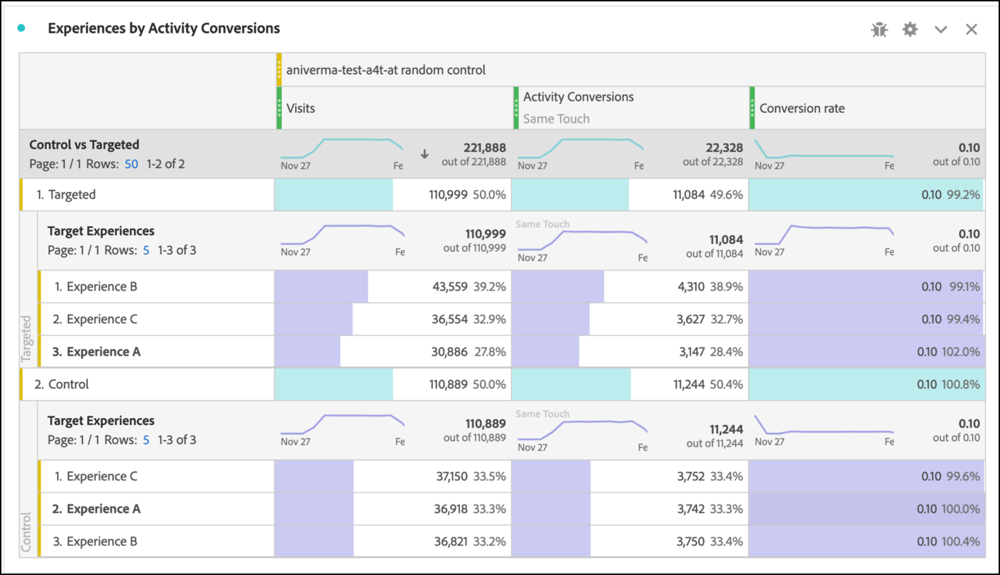

# [!DNL Auto-Target] 활동을 위해 Analysis Workspace에서 A4T 보고서 설정

[!DNL Auto-Target] 활동에 대한 Analytics for Target(A4T) 통합은 Adobe Target의 Ensemble ML(기계 학습) 알고리즘을 사용하여 Adobe Analytics 목표 지표를 사용하는 동안 프로필, 행동 및 컨텍스트에 따라 각 방문자에 대해 최상의 경험을 선택합니다.

Adobe Analytics Analysis Workspace에서 다양한 분석 기능을 사용할 수 있지만, 실험 활동(수동 A/B 및 자동 할당)과 개인화 활동([!DNL Auto-Target])의 차이로 인해 기본 **[!UICONTROL Target 분석]** 패널을 일부 수정해야 합니다.[!DNL Auto-Target]

이 자습서에서는 다음 주요 개념을 기반으로 하는 Workspace에서 [!DNL Auto-Target] 활동 분석을 위한 권장 수정 사항을 안내합니다.

* **[!UICONTROL 컨트롤과 타깃팅된]** 차원은 [!DNL Auto-Target] 앙상블 ML 알고리즘에서 제공하는 경험과 컨트롤 경험을 구분하는 데 사용할 수 있습니다.
* 방문 횟수는 성능의 경험 수준 분류를 볼 때 정규화 지표로 사용해야 합니다. 또한 [Adobe Analytics의 기본 계산 방법론에는 사용자가 실제로 활동 컨텐츠](https://experienceleague.adobe.com/docs/target/using/integrate/a4t/a4t-faq/a4t-faq-viewing-reports.html?lang=en#metrics)를 보지 않는 방문이 포함될 수 있지만, 이 기본 동작은 적절한 범위 세그먼트를 사용하여 수정할 수 있습니다(아래 세부 사항).
* 지정된 속성 모델에 대해 &quot;방문 전환 확인 기간&quot;이라고도 하는 방문 전환 확인 범위 속성은 교육 단계 동안 Adobe Target의 ML 모델에서 사용되며, 목표 지표를 분류할 때는 동일한(기본값이 아닌) 속성 모델을 사용해야 합니다.

## 작업 공간에서 [!DNL Auto-Target] 패널에 대한 A4T 만들기

[!DNL Auto-Target] 보고서에 대한 A4T를 만들려면 아래 표시된 대로 Workspace에서 **[!UICONTROL Target에 대한 분석]** 패널로 시작하거나 자유 형식 테이블로 시작하십시오. 그런 다음 다음을 선택합니다.

1. **[!UICONTROL 제어 경험]**: 어떤 경험이든 선택할 수 있습니다. 그러나 이 선택 사항은 나중에 재정의할 수 있습니다. [!DNL Auto-Target] 활동의 경우, 제어 경험은 a) 모든 경험에서 임의로 제공되는 제어 전략이거나 b) 단일 경험을 제공합니다(이 선택 사항은 Adobe Target에서 활동 생성 시 수행). 선택 (b)—your [!DNL Auto-Target] 활동에서 특정 경험을 제어로 지정한 경우에도, [!DNL Auto-Target] 활동에 대한 A4T를 분석하기 위해 이 자습서에 설명된 접근 방식을 따라야 합니다.
2. **[!UICONTROL 지표 정규화]**: 방문 횟수 를 선택합니다.
3. **[!UICONTROL 성공 지표]**: 보고할 지표를 선택할 수 있지만 일반적으로 Adobe Target에서 활동을 만들 때 최적화를 위해 선택한 것과 동일한 지표에 대한 보고서를 볼 수 있습니다.

*png그림 1: 활동에 대한 Target 패널  [!DNL Auto-Target] 설정입니다.*

>[!NOTE]
>
>자동 Target 활동에 대한 Analytics for Target 패널을 설정하려면 제어 경험을 선택하고 정규화 지표로 방문 횟수를 선택한 다음 Target 활동 생성 중에 최적화를 위해 선택한 것과 동일한 목표 지표를 선택하십시오.

## 컨트롤 및 타깃팅된 차원을 사용하여 Adobe Target의 앙상블 ML 모델을 제어와 비교할 수 있습니다

기본 A4T 패널은 개별 경험의 성능을 제어 경험과 비교하는 것이 목표인 클래식(수동) A/B 테스트 또는 자동 할당 활동용으로 설계되었습니다. 그러나 [!DNL Auto-Target] 활동에서는 첫 번째 순서 비교가 Control *strategy* Targeted *strategy* (즉, 제어 전략에 대해 [!DNL Auto-Target] Ensemble ML 모델의 전체 성능 상승도를 결정하는 경우) 사이여야 합니다.

이 비교를 수행하려면 **[!UICONTROL 컨트롤과 타깃팅된 (Target 분석)]** 차원을 사용하십시오. 끌어다 놓아 기본 A4T 보고서에서 **[!UICONTROL Target 경험]** 차원을 바꿉니다.

이 교체는 A4T 패널에서 기본 상승도 및 신뢰도 계산을 무효화합니다. 혼동을 방지하기 위해 다음 보고서를 남겨둔 채 기본 패널에서 이러한 지표를 제거할 수 있습니다.

*png 그림 2: 활동에 대한 권장 기준  [!DNL Auto-Target] 보고서입니다. 이 보고서는 타깃팅된 트래픽(Ensemble ML 모델에 의해 제공됨)을 제어 트래픽과 비교하도록 구성되었습니다.*

>[!NOTE]
>
>현재, 상승도 및 신뢰도 번호는 자동 Target에 대한 A4T 보고서에 대한 컨트롤과 타깃팅된 차원에는 사용할 수 없습니다. 지원이 추가되기 전까지 [신뢰도 계산기](https://experienceleague.adobe.com/docs/target/assets/complete_confidence_calculator.xlsx?lang=en)를 다운로드하여 상승도 및 신뢰도를 수동으로 계산할 수 있습니다.

## 지표의 경험 수준 분류 추가

Ensemble ML 모델이 수행되는 방식에 대한 자세한 통찰력을 얻으려면 **[!UICONTROL Control과 Targeted]** 차원의 경험 수준 분류를 검사할 수 있습니다. Workspace에서 **[!UICONTROL Target 경험]** 차원을 보고서에 드래그한 다음 각 제어 및 타깃팅된 차원을 개별적으로 분류합니다.

*png 그림 3: Target 경험별로 타깃팅된 차원 분류*

결과 보고서의 예는 다음과 같습니다.

*png 그림 4: 경험  [!DNL Auto-Target] 수준 분류가 있는 표준 보고서입니다. 목표 지표는 다를 수 있으며, 제어 전략에는 단일 경험이 있을 수 있습니다.*

>[!TIP]
>
>Workspace에서 톱니바퀴 아이콘을 클릭하여 전환율 열의 백분율을 숨겨 경험 전환율에 계속 집중할 수 있습니다. 그러면 전환율은 십진수로 포맷되지만 그에 따라 백분율로 해석됩니다.

## &quot;방문 횟수&quot;가 [!DNL Auto-Target] 활동에 대한 올바른 정규화 지표인 이유는 무엇입니까

[!DNL Auto-Target] 활동을 분석할 때에는 항상 방문을 기본 정규화 지표로 선택하십시오. [!DNL Auto-Target] 개인화는 방문당 한 번(공식적으로, Adobe Target 세션당 한 번)에 대해 경험을 선택합니다. 즉, 사용자에게 표시되는 경험은 모든 방문 시 변경될 수 있습니다. 따라서 정규화 지표로 고유 방문자 수를 사용하는 경우 단일 사용자가 여러 경험(다른 방문에서)을 볼 수 있으므로 전환율이 혼동될 수 있습니다.

간단한 예는 이 점을 보여줍니다. 두 방문자가 두 개의 경험만 있는 캠페인에 들어가는 시나리오를 고려하십시오. 첫 번째 방문자가 두 번 방문합니다. 첫 번째 방문에서는 경험 A에 할당되지만, 두 번째 방문에서는 경험 B가 할당됩니다(해당 두 번째 방문에서 프로필 상태가 변경되어). 두 번째 방문 후 방문자는 순서를 지정하여 전환됩니다. 전환은 가장 최근에 표시된 경험(경험 B)으로 인한 것입니다. 두 번째 방문자도 두 번 방문하며 두 번 모두 경험 B를 표시하지만 전환되지는 않습니다.

방문자 수준 및 방문 수준 보고서를 비교할 수 있습니다.

| 경험 | 고유 방문자 수 | 방문 횟수 | 변환 | 방문자 기준. Conv. 비율 | 방문 기준. Conv. 비율 |
| --- | --- | --- | --- | --- | --- |
| A | 1 | 1 | - | 0% | 0% |
| B | 2 | 3 | 1 | 50% | 33.3% |
| 총계 | 2개 | 4 | 1 | 50% | 25% |
*표 1: 결정이 방문과 고정(방문자가 아님)되는 시나리오에 대한 방문자 정규화 및 방문 정규화 보고서를 비교하는 예제. 방문자가 표준화된 지표는 이 시나리오에서 혼동을 줍니다.*

표에 표시된 대로 방문자 수준 숫자의 명확한 차이가 있습니다. 총 고유 방문자 수가 두 명이라는 사실에도 불구하고 각 경험에 대한 개별 고유 방문자 수의 합이 아닙니다. 방문자 수준 전환율이 반드시 잘못된 것은 아니지만, 한 사람이 개별 경험을 비교할 때 방문 수준 전환율은 거의 틀림없이 더 적절합니다. 일반적으로 분석 단위(&quot;방문 횟수&quot;)는 의사 결정 고착성 단위와 동일합니다. 즉, 지표의 경험 수준 분류를 추가 및 비교할 수 있습니다.

## 활동에 대한 실제 방문 횟수를 필터링합니다

Adobe Analytics의 Target 활동 방문 기본 계산 방법론에는 사용자가 Target 활동과 상호 작용하지 않은 방문이 포함될 수 있습니다. 이는 Target 활동 할당이 Analytics 방문자 컨텍스트에서 지속되는 방식 때문입니다. 결과적으로 Target 활동에 대한 방문 횟수가 부풀려져 전환율이 낮아지는 경우가 있습니다.

사용자가 실제로 자동 Target 활동과 상호 작용한 방문 횟수(활동에 대한 시작, 디스플레이/방문 이벤트 또는 전환을 통해)를 보고하려는 경우, 다음을 수행할 수 있습니다.

1. 해당 Target 활동의 히트를 포함하는 특정 세그먼트를 만든 다음
1. 이 세그먼트를 사용하여 방문 횟수 지표를 필터링합니다.

**세그먼트를 만들려면:**

1. 작업 공간 도구 모음에서 **[!UICONTROL 구성 요소 > 세그먼트 만들기]** 옵션을 선택합니다.
2. 세그먼트의 **[!UICONTROL 제목]**&#x200B;을 입력합니다. 아래 표시된 예에서 세그먼트의 이름은 [!DNL "Hit with specific Auto-Target activity"]입니다.
3. **[!UICONTROL Target 활동]** 차원을 세그먼트 **[!UICONTROL 정의]** 섹션으로 드래그합니다.
4. **[!UICONTROL equals]** 연산자를 사용하십시오.
5. 특정 Target 활동을 검색합니다.
6. 톱니바퀴 아이콘을 선택하고 아래 그림과 같이 **[!UICONTROL 기여도 분석 모델 > 인스턴스]**&#x200B;를 선택합니다.
7. **[!UICONTROL 저장]**&#x200B;을 클릭합니다.

*png그림 5: 여기에 표시된 세그먼트와 같은 세그먼트를 사용하여 보고서를 위해 A4T에서 방문 지표를  [!DNL Auto-Target] 필터링합니다*

세그먼트가 만들어지면 이를 사용하여 방문 횟수 지표를 필터링하므로 방문 횟수 지표에는 사용자가 Target 활동과 상호 작용한 방문만 포함됩니다.

**이 세그먼트를 사용하여 방문을 필터링하려면:**

1. 구성 요소 도구 모음에서 새로 만든 세그먼트를 드래그하고 **[!UICONTROL 방문 횟수]** 지표 레이블의 기준 위로 마우스를 가져가면 파란색 **[!UICONTROL 필터 기준]** 메시지가 나타날 때까지 이 지표를 마우스로 가리킵니다.
2. 세그먼트를 해제합니다. 필터가 해당 지표에 적용됩니다.

최종 패널은 다음과 같이 나타납니다.

*png 그림 6: 방문자 지표에 &quot;특정 자동 Target 활동을 사용한 히트&quot; 세그먼트가 적용된 보고   패널. 이렇게 하면 사용자가 실제로 해당 Target 활동과 상호 작용한 방문만 보고서에 포함됩니다.*

## ML 모델 교육과 목표 지표 생성 간의 기여도 분석 정렬

A4T 통합을 사용하면 [!DNL Auto-Target] 의 ML 모델을 *Adobe Analytics에서*&#x200B;성능 보고서 생성&#x200B;*에 사용하는 것과 동일한 전환 이벤트 데이터를 사용하여 교육할 수 있습니다.* 그러나 ML 모델을 교육할 때 Adobe Analytics에서 보고 단계 동안 수행된 기본 가정과는 다른, 이 데이터를 해석하는 데 사용해야 하는 특정 가정을 있습니다.

특히 Adobe Target의 ML 모델은 방문 범위 속성 모델을 사용합니다. 즉, ML 모델에서 수행한 결정에 전환이 &quot;특성&quot;이 되도록 하려면 활동에 대한 컨텐츠 표시와 동일한 방문에서 전환이 발생해야 한다고 가정합니다. Target이 모델을 적시에 교육할 수 있도록 하기 위해 필요합니다. Target은 전환(Adobe Analytics의 보고서에 대한 기본 속성 창)을 위해 최대 30일 동안 기다렸다가 모델의 교육 데이터에 포함할 수 없습니다.

따라서, Target 모델에서 사용되는 속성(교육 중)과 데이터를 쿼리하는 데 사용되는 기본 속성(보고서 생성 중)의 차이가 불일치할 수 있습니다. 실제로 문제가 속성에 있는 경우 ML 모델이 성과가 낮은 것으로 보일 수도 있습니다.

>[!TIP]
>
>ML 모델이 보고서에서 보고 있는 지표와 다르게 특성이 있는 지표에 대해 최적화되는 경우 모델이 예상대로 수행되지 않을 수 있습니다. 이를 방지하려면 보고서의 목표 지표가 Target의 ML 모델에서 사용하는 것과 동일한 속성을 사용하는지 확인하십시오.

Adobe Target의 ML 모델에서 사용되는 것과 동일한 속성 방식이 있는 목표 지표를 보려면 다음 단계를 수행하십시오.

1. 목표 지표의 톱니바퀴 아이콘 위로 마우스를 가져갑니다.
   
1. 결과 메뉴에서 **[!UICONTROL 데이터 설정]**&#x200B;으로 스크롤합니다.
1. **[!UICONTROL 기본값이 아닌 속성 모델 사용]**(아직 선택하지 않은 경우)을 선택합니다.
   
1. **[!UICONTROL 편집]**&#x200B;을 클릭합니다.
1. **[!UICONTROL 모델]**&#x200B;을 선택합니다. **[!UICONTROL 기여도]** 및 **[!UICONTROL 전환 확인 기간]**: **[!UICONTROL 방문]**.
   
1. **[!UICONTROL 적용]**&#x200B;을 클릭합니다.

이러한 단계는 경험이 표시된 동일한 방문에서 목표 지표 이벤트가 *언제든지*(&quot;기여도&quot;)가 발생한 경우 보고서가 경험 표시에 목표 지표를 기여하도록 하는 것입니다.

## 최종 단계: 위의 마법을 캡처하는 전환율을 만듭니다

이전 섹션의 방문 및 목표 지표를 수정하여 [!DNL Auto-Target] 보고 패널에 대해 기본 A4T에 적용해야 하는 최종 수정 사항은 올바른 속성을 갖는 목표 지표의 비율인 전환율을 적절하게 필터링된 &quot;방문&quot; 지표로 만드는 것입니다.

다음 단계를 사용하여 계산된 지표를 만들어 이 작업을 수행합니다.

1. 작업 공간 도구 모음에서 **[!UICONTROL 구성 요소 > 지표 만들기]** 옵션을 선택합니다.
1. 지표에 대해 **[!UICONTROL 제목]**&#x200B;을 입력합니다. 예를 들어, &quot;Activity XXX에 대한 방문 수정 전환율&quot;이 있습니다.
1. **[!UICONTROL 형식]** = 퍼센트 및 **[!UICONTROL 소수점 이하 자리 수]** = 2를 선택합니다.
1. 활동에 대한 관련 목표 지표(예: 활동 전환)를 정의로 드래그하고 이 목표 지표의 톱니바퀴 아이콘을 사용하여 앞에서 설명한 대로 기여도|방문)을 기여도 분석 모델로 조정합니다.
1. **[!UICONTROL 정의]** 섹션의 오른쪽 상단에 있는 **[!UICONTROL 추가 > 컨테이너]**&#x200B;를 선택합니다.
1. 두 컨테이너 사이에 나누기(÷) 연산자를 선택합니다.
1. 이 특정 [!DNL Auto-Target] 활동에 대해 이 자습서에서 &quot;특정 [!DNL Auto-Target] 활동을 사용하여 히트&quot;라는 이전에 만든 세그먼트를 드래그합니다.
1. **[!UICONTROL 방문 횟수]** 지표를 세그먼트 컨테이너로 드래그합니다.
1. **[!UICONTROL 저장]**&#x200B;을 클릭합니다.

전체 계산된 지표 정의가 여기에 표시됩니다.

*png 그림 7: 방문 및 기여도 분석이 수정된 모델 전환율 지표 정의입니다. (이 지표는 목표 지표 및 활동에 따라 다릅니다. 즉, 이 지표 정의는 활동 간에 다시 사용할 수 없습니다.)*

>[!IMPORTANT]
>
>A4T 패널의 전환율 지표는 테이블의 전환 이벤트 또는 정규화 지표에 연결되어 있지 않습니다. 이 자습서에서 수정 사항을 제안하면 전환율이 변경 사항에 자동으로 조정되지 않습니다. 따라서 전환 이벤트 속성 및 정규화 지표 중 하나(또는 둘 다)를 수정하는 경우, 위에 표시된 대로 전환율을 수정하는 마지막 단계로 기억해야 합니다.

## 요약: [!DNL Auto-Target] 보고서에 대한 최종 샘플 작업 공간 패널

위의 모든 단계를 단일 패널에 결합하는 경우 아래 그림은 [!DNL Auto-Target] A4T 활동에 대한 권장 보고서의 전체 보기를 보여줍니다. 이 보고서는 목표 지표를 최적화하기 위해 Target의 기계 학습 모델에서 사용하는 것과 동일하며 이 자습서에서 설명하는 모든 뉘앙스와 권장 사항을 통합합니다. 이 보고서는 기존의 Target 보고 기반 [!DNL Auto-Target] 활동에서 사용되는 계산 방법론에도 가장 가깝습니다.

*png그림 8: 이  [!DNL Auto-Target] 문서의 이전 섹션에 설명된 지표 정의에 대한 모든 조정을 결합하는 Adobe Analytics Workspace의 최종 A4T 보고서입니다.*
