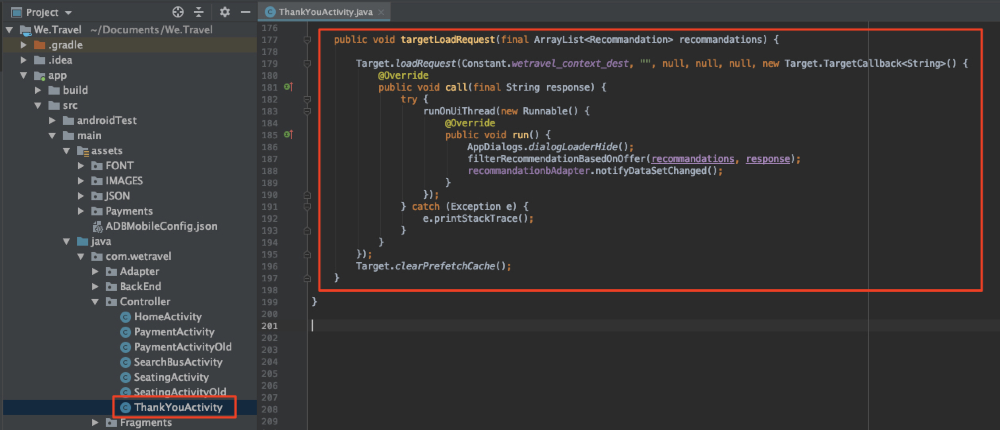

# Adobe Target 요청 추가

Adobe Mobile Services SDK(v4)는 다양한 사용자를 위해 다양한 경험을 사용하여 앱을 개인화할 수 있는 Adobe Target 메서드 및 기능을 제공합니다. 일반적으로 앱에서 Adobe Target으로 하나 이상의 요청을 수행하여 개인화된 콘텐츠를 검색하고 해당 콘텐츠의 영향을 측정합니다.

이 단원에서는 [!DNL Target] 요청을 구현하여 개인화를 위한 We.Travel 앱을 준비합니다.

## 전제 조건

[샘플 앱을 다운로드하여 업데이트하십시오](download-and-update-the-sample-app.md).

## 학습 목표

이 단원을 마치면 다음을 수행할 수 있습니다.

* 배치 미리 가져오기 요청을 사용하여 여러 [!DNL Target] 오퍼(즉, 개인화된 컨텐츠)를 캐시합니다
* 미리 가져온 [!DNL Target] 위치 로드
* 실시간으로 [!DNL Target] 위치 로드(프리페치되지 않음)
* 캐시에서 프리페치된 위치 지우기
* 미리 가져오기 및 실시간 요청 확인

## 용어

다음은 이 자습서의 나머지 부분에서 사용할 몇 가지 주요 Target 용어입니다.

* **요청:**  Adobe Target 서버에 대한 네트워크 요청
* **오퍼:**   [!DNL Target] 사용자 인터페이스(또는 API를 사용하여)에 정의된 코드 또는 기타 텍스트 기반 컨텐츠의 코드 조각이며, 응답으로 전달됩니다. 보통 [!DNL Target]이 기본 모바일 앱에서 사용되는 경우 JSON입니다.
* **위치:**  요청에 지정된 사용자 정의 이름으로, 인터페이스에서 오퍼 [!DNL Target] 를 특정 요청과 연결하는 데 사용됩니다
* **배치 요청:**   여러 위치를 포함하는 단일 요청
* **미리 가져오기 요청:**   앱에서 나중에 사용할 수 있도록 오퍼를 검색하고 메모리에 캐시하는 단일 요청입니다
* **배치 미리 가져오기 요청:**   여러 위치에 대한 오퍼를 미리 가져오는 단일 요청입니다
* **대상:**  인터페이스에 정의되거나  [!DNL Target] 다른 Adobe 애플리케이션 [!DNL Target] 에서 로 공유되는 방문자 그룹입니다(예: &quot;iPhone X 방문자&quot;, &quot;캘리포니아 방문자&quot;, &quot;첫 번째 앱 열기&quot;)
* **활동:**   [!DNL Target] 개인화된 경험을 만들기 위해 위치, 오퍼 및 대상을  [!DNL Target] 연결하는 사용자 인터페이스(또는 API로)에 정의된 구성입니다

## 배치 미리 가져오기 요청 추가

We.Travel에서 구현할 첫 번째 요청은 홈 화면에서 두 개의 [!DNL Target] 위치가 있는 배치 미리 가져오기 요청입니다. 이후 단원에서는 이러한 위치에 대한 오퍼를 구성하여 예약 프로세스를 통해 새로운 사용자를 안내하는 메시지를 표시합니다.

미리 가져오기 요청은 Adobe Target 서버 응답(오퍼)을 캐시하여 가능한 한 최소 [!DNL Target] 컨텐츠를 가져옵니다. 배치 미리 가져오기 요청은 각각 다른 위치와 연결된 여러 오퍼를 검색하고 캐시합니다. 미리 가져온 모든 위치는 사용자 세션에서 나중에 사용할 수 있도록 장치에 캐시됩니다. 홈 화면에서 여러 위치를 미리 가져와서 방문자가 앱을 탐색할 때 나중에 사용할 오퍼를 검색할 수 있습니다. 미리 가져오기 방법에 대한 자세한 내용은 [미리 가져오기 설명서](https://experienceleague.adobe.com/docs/mobile-services/android/target-android/c-mob-target-prefetch-android.html?lang=en)를 참조하십시오.

### 배치 미리 가져오기 요청 추가

홈 활동 컨트롤러(홈 화면의 소스 코드)를 업데이트하여 앱 > 기본 > java > com.wetrlevel > Controller 아래에 있습니다. 빨간색으로 표시된 두 개의 코드 블록을 추가합니다.

먼저 HomeActivity 컨트롤러(홈 화면의 소스 코드)부터 시작하겠습니다. 이 코드는 앱 > 기본 > java > com.wetravel > Controller 아래에 있습니다.

빨간색으로 표시된 두 개의 코드 블록을 추가합니다.


HomeActivity의 코드 끝까지 아래로 스크롤하고 `setHeader()` 함수 및 *현재 `onResume()` 함수를 대체하는 후 아래에 제공된 코드를 추가합니다.*

```java
@Override
protected void onResume() {
    super.onResume();
    targetPrefetchContent();
}

public void targetPrefetchContent() {
    List<TargetPrefetchObject> prefetchList = new ArrayList<>();
    prefetchList.add(Target.createTargetPrefetchObject(Constant.wetravel_engage_home, null));
    prefetchList.add(Target.createTargetPrefetchObject(Constant.wetravel_engage_search, null));
    Target.TargetCallback<Boolean> prefetchStatusCallback = new Target.TargetCallback<Boolean>() {
        @Override
        public void call(final Boolean status) {
            HomeActivity.this.runOnUiThread(new Runnable() {
                @Override
                public void run() {
                    String cachingStatus = status ? "YES" : "NO";
                    System.out.println("Received Response from prefetch : " + cachingStatus);
                    setUp();

                }
            });
        }};
    Target.prefetchContent(prefetchList, null, prefetchStatusCallback);
}
```

IDE에서 파일에 가져온 [!DNL Target] 클래스가 없다는 것을 경고할 수 있습니다. 아래의 빨간색으로 표시된 대로 HomeActivity 컨트롤러 맨 위에 있는 [!DNL Target] 클래스를 가져와야 합니다.

```java
import com.adobe.mobile.Target;
import com.adobe.mobile.TargetPrefetchObject;
```


&quot;symbol variable wetlevel_engage_home을 찾을 수 없음&quot; 및 &quot;symbol variable wetrlevel_engage_search&quot;에 대한 오류가 표시될 수 있습니다. 다음 파일을 `Constant.java` 파일(앱 > src > main > java > com > wetrlevel > Utils)에 추가합니다.

```java
public static final String wetravel_engage_home = "wetravel_engage_home";
public static final String wetravel_engage_search = "wetravel_engage_search";
```


### 배치 미리 가져오기 요청 코드 설명

| 코드 | 설명 |
|--- |--- |
| `targetPrefetchContent()` | [!DNL Target] 메서드를 사용하여 두 개의 [!DNL Target] 위치를 검색하고 캐시하는 사용자 정의 함수(SDK의 일부가 아님)입니다. |
| `prefetchContent()` | 미리 가져오기 요청을 보내는 [!DNL Target] SDK 메서드 |
| `Constant.wetravel_engage_home` | 홈 화면에 오퍼 콘텐츠를 표시할 [!DNL Target] 위치 이름을 미리 가져옵니다. |
| `Constant.wetravel_engage_search` | 검색 결과 화면에서 해당 오퍼 컨텐츠를 표시할 [!DNL Target] 위치 이름을 미리 가져왔습니다. 미리 가져오기의 두 번째 위치이므로 이 미리 가져오기 요청을 &quot;미리 가져오기 배치 요청&quot;이라고 합니다. |
| setUp() | [!DNL Target] 오퍼를 미리 가져온 후 앱의 홈 화면을 렌더링하는 사용자 정의 함수입니다 |

### 비동기식과 동기 정보

방금 구현한 코드로 인해, 홈 화면이 렌더링되기 바로 전에 미리 가져오기 요청이 동기, 차단 호출로 수행됩니다. 새 코드를 HomeActivity 컨트롤러에 붙여넣을 때 Target 요청 후까지 `setUp()` 함수 실행을 `onResume()` 함수에서 이동했습니다. 이 기능은 첫 번째 화면이 렌더링되기 전에 Target 서버에서 개인화된 컨텐츠가 반환되거나 시간 초과되도록 하기 때문에 앱을 처음 열 때 컨텐츠를 개인화하려는 시나리오에서 유용합니다. 요청이 비동기식으로 로드되도록(백그라운드에서) 하려면 대신 `onCreate()` 함수 내에서 `setUp()`을 호출하십시오.

### 배치 미리 가져오기 요청의 유효성 검사

앱을 다시 빌드하고 Android 에뮬레이터를 엽니다. (다음 스크린샷은 Android Q 버전 9+, API 레벨 29에서 Pixel 2를 사용합니다.) 미리 가져오기 응답은 &quot;받은 미리 가져오기 응답&quot;을 읽어야 합니다.

홈 화면이 렌더링될 때 미리 가져오기 요청을 로드해야 합니다. Logcat을 사용하여 [!DNL "Target"]에 대해 필터링하여 요청 및 응답을 확인합니다.


성공적인 응답이 표시되지 않으면 `ADBMobileConfig.json` 파일의 설정과 HomeActivity 파일의 코드 구문을 확인하십시오.

이제 두 위치가 장치에 캐시됩니다. 위치 이름은 [!DNL Target] 인터페이스에 곧 지연되어 로드되며, 여기서 활동에서 이 이름을 사용할 때 다양한 드롭다운 메뉴에서 선택할 수 있습니다.

### 캐시된 각 위치에 대한 로드 요청 추가

이제 위치를 미리 가져오고 장치에 캐시된 해당 응답을 가져오려면 캐시에서 오퍼 컨텐츠를 검색하는 `Target.loadRequest()` 메서드를 추가하여 애플리케이션을 업데이트하도록 하겠습니다. 미리 가져오기 요청과 함께 실행되는 `engageMessage()` 이라는 새 사용자 지정 메서드를 추가합니다. `engageMessage()` 이  `Target.loadRequest()`호출됩니다. `engageMessage()` 가 실행되기 전 `setUp()` 에 실행되어 화면이 설정되기 전에 로드 요청이 호출되는지 확인합니다.

먼저 HomeActivity에서 wetravel_engage_home 위치에 대해 `engageMessage()` 호출 및 메서드를 추가합니다.


다음은 업데이트된 코드입니다.

```java
    public void targetPrefetchContent() {
        List<TargetPrefetchObject> prefetchList = new ArrayList<>();
        Map<String, Object> params1;
        params1 = new HashMap<String, Object>();
        params1.put("at_property", "your at_property value goes here");
        prefetchList.add(Target.createTargetPrefetchObject(Constant.wetravel_engage_home, params1));
        prefetchList.add(Target.createTargetPrefetchObject(Constant.wetravel_engage_search, params1));
        Target.TargetCallback<Boolean> prefetchStatusCallback = new Target.TargetCallback<Boolean>() {
            @Override
            public void call(final Boolean status) {
                HomeActivity.this.runOnUiThread(new Runnable() {
                    @Override
                    public void run() {
                        String cachingStatus = status ? "YES" : "NO";
                        System.out.println("Received Response from prefetch : " + cachingStatus);
                        engageMessage();
                        setUp();
                    }
                });
            }};
        Target.prefetchContent(prefetchList, null, prefetchStatusCallback);
    }
    public void engageMessage() {
        Target.loadRequest(Constant.wetravel_engage_home, "", null, null, null,
            new Target.TargetCallback<String>(){
                @Override
                public void call(final String s) {
                    runOnUiThread(new Runnable() {
                        @Override
                        public void run() {
                            System.out.println("Engage Message : " + s);
                            if(s != null && !s.isEmpty()) Utility.showToast(getApplicationContext(), s);
                        }
                    });
                }
            });
    }
```

이제 SearchBusActivity에서 wetravel_engage_search 위치에 대한 `engageMessage()` 호출 및 메서드를 추가합니다. `engageMessage()` 호출은 `setUpSearch()` 호출 전에 `onResume()` 메서드에 설정되므로 화면이 설정되기 전에 실행됩니다.


다음은 업데이트된 코드입니다.

```java
    @Override
    public void onResume() {
        super.onResume();
        engageMessage();
        setUpSearch();
    }
    public void engageMessage() {
        Target.loadRequest(Constant.wetravel_engage_search, "", null, null, null,
                new Target.TargetCallback<String>(){
                    @Override
                    public void call(final String s) {
                        runOnUiThread(new Runnable() {
                            @Override
                            public void run() {
                                System.out.println("Engage Message : " + s);
                                if(s != null && !s.isEmpty()) Utility.showToast(getApplicationContext(), s);
                            }
                        });
                    }
                });
    }
```

SearchBusActivity에 Target 메서드를 방금 추가했으므로 [!DNL Target] 클래스를 가져와야 합니다.

```java
import com.adobe.mobile.Target;
import com.adobe.mobile.TargetPrefetchObject;
```

## 실시간 요청 추가

다음에 앱에 추가하려는 요청은 감사 화면의 실시간 요청이 됩니다. &quot;실시간&quot;은 두 요청이 모두 수행되고 응답이 즉시 적용됩니다(나중에 캐시되지 않음). 나중에 이 요청을 사용하여 사용자의 여행 대상에 맞게 개인화된 경험을 구축합니다.

따라서 감사 화면에 실시간 요청을 추가하겠습니다. ThankYouActivity 파일에서 빨간색으로 표시된 변경 작업을 수행합니다.


ThankYouActivity 파일의 끝까지 스크롤합니다. `getRecommandations()` 함수에서 세 줄을 주석과 `targetLoadRequest()` 함수의 호출을 추가합니다.

```java
// AppDialogs.dialogLoaderHide();
// recommandations.addAll(recommandation.recommandations);
// recommandationbAdapter.notifyDataSetChanged();
```

다음 코드 행을 `getRecommandations()` 함수에 추가합니다.

```java
targetLoadRequest(recommandation.recommandations);
```

이제 `targetLoadRequest()` 함수를 정의해야 합니다.


`filterRecommendationBasedOnOffer()` 함수 뒤에 이 코드 블록을 추가합니다.

```java
public void targetLoadRequest(final ArrayList<Recommandation> recommandations) {
    Target.loadRequest(Constant.wetravel_context_dest, "", null, null, null, new Target.TargetCallback<String>() {
        @Override
        public void call(final String response) {
            try {
                runOnUiThread(new Runnable() {
                    @Override
                    public void run() {
                        AppDialogs.dialogLoaderHide();
                        filterRecommendationBasedOnOffer(recommandations, response);
                        recommandationbAdapter.notifyDataSetChanged();
                    }
                });
            } catch (Exception e) {
                e.printStackTrace();
            }
        }
    });
}
```

ThankYouActivity에 Target 메서드를 방금 추가했으므로 Target 클래스를 가져와야 합니다.

```java
import com.adobe.mobile.Target;
import com.adobe.mobile.TargetPrefetchObject;
```

### targetLoadRequest() 코드 설명

| 코드 | 설명 |
|--- |--- |
| `targetLoadRequest()` | Wetlevel_context_dest 위치를 로드하여 표시하는 `Target.loadRequest()`을 실행하는 사용자 정의 함수(SDK의 일부가 아님) |
| `Target.loadRequest()` | Target 서버에 요청을 하는 SDK 메서드 |
| Constant.wetravel_context_dest | [!DNL Target] 인터페이스에서 활동을 작성할 때 나중에 사용할 요청에 지정된 위치 이름입니다 |
| `filterRecommendationBasedOnOffer()` | Target 응답에서 위치 오퍼를 가져와서 오퍼의 컨텐츠를 기반으로 앱을 어떻게 변경해야 하는지 결정하는 앱의 사용자 정의 함수입니다 |
| `recommandations.addAll()` | ThankYou 화면을 로드할 때 기본적으로 실행되는 데 사용되었지만 이제 Target 응답이 `filterRecommendationBasedOnOffer()`에 의해 수신되고 구문 분석된 후 실행되는 앱의 사용자 정의 함수입니다 |

이것은 앱에 대해 보다 정교한 업데이트이며 그 다음 홈 화면에 추가한 요청과 함께 수행되었습니다. 이제 작업을 잠시 살펴보겠습니다.

1. 코드 행에 주석을 달면서 3개의 기본 프로모션을 표시하는 앱의 이전 동작을 중단했습니다
1. 대신 앱에 새 함수를 실행하도록 지시했으며 이 기능을 임의로 targetLoadRequest 로 명명했습니다
1. Target.loadRequest 메서드를 사용하여 Target에 요청을 하도록 `targetLoadRequest` 함수를 정의하고 [!DNL Target] 오퍼 응답이 수신되면 `filterRecommendationBasedOnOffer()` 함수를 즉시 실행합니다
1. `filterRecommendationBasedOnOffer()` 함수는 응답을 해석하고 화면에 적용할 프로모션을 결정합니다

이는 모바일 앱에서 [!DNL Target]을 사용할 때 발생하는 매우 일반적인 사용 패턴입니다.  모바일 앱의 거의 모든 측면을 개인화할 수 있다는 점에서 두 가지 모두 매우 강력합니다. 또한 앱 코드와 나중에 [!DNL Target] 인터페이스에서 정의할 오퍼 간의 조정도 필요합니다. 이러한 조정에 의해 일부 개인화 사용 사례에서는 활동을 실행하기 위해 앱스토어에서 앱을 업데이트해야 할 수 있습니다.

### 실시간 요청의 유효성 검사

Android 에뮬레이터를 열고 이동을 예약하는 모든 단계를 수행합니다. 홈 > 버스 검색 결과 > 시트 선택, 결제 옵션(빈 데이터가 있는 모든 결제 옵션이 작동함).

마지막 감사 화면에서 Logcat에서 응답을 확인합니다. 응답은 &quot;wetlevel_context_dest&quot;에 대해 기본 컨텐츠가 반환되었습니다.


## 캐시에서 프리페치된 위치 지우기

세션 중에 미리 가져온 위치를 지워야 하는 경우가 있을 수 있습니다. 예를 들어 예약이 발생하면 사용자가 이제 &quot;참여&quot;로 전환되고 예약 프로세스를 이해하므로 캐시된 위치를 지우는 것이 적절합니다. 세션 중에 다른 여행을 예약하면 홈 화면과 검색 결과 화면에서 원래 위치가 예약되어 있는 것이 아닙니다. 캐시에서 위치를 지우고 할인된 두 번째 예약 또는 다른 관련 시나리오에 대한 새 오퍼를 미리 가져오는 것이 더 적절합니다. 세션 중에 예약한 경우 홈 화면 및 검색 결과 화면에 논리를 추가하여 새 위치를 미리 가져올 수 있습니다.

이 예제에서는 예약이 발생하면 세션에 대해 미리 가져온 위치를 지웁니다. 이 작업은 `Target.clearPrefetchCache()` 함수를 호출하여 수행됩니다. 아래 표시된 대로 `targetLoadRequest()` 함수 내에 함수를 설정합니다.

```java
Target.clearPrefetchCache()
```


축하합니다! 이제 앱에 개인화 프레임워크가 있습니다. 다음 단원에서는 이러한 위치에 매개 변수를 추가하여 개인화 기능을 개선합니다.

**[다음 : &quot;매개 변수 추가&quot; >](add-parameters.md)**
