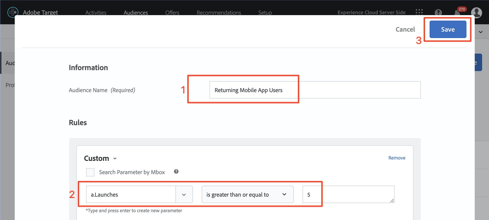
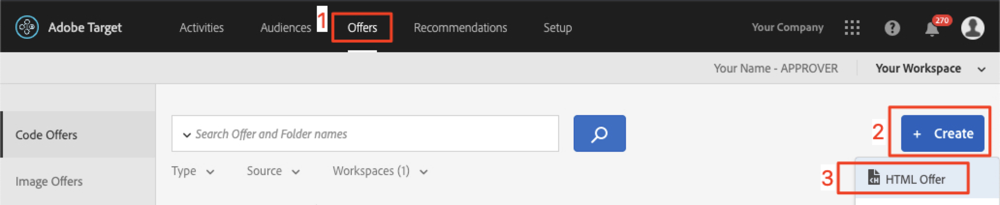

# Adobe Target에서 대상 및 오퍼 만들기

이 단원에서는 [!DNL Target] 인터페이스로 이동하고 이전 단원에서 구현한 세 개의 위치에 대한 대상 및 오퍼를 작성합니다.

## 학습 목표

이 단원을 마치면 다음을 수행할 수 있습니다.

* Adobe Target에서 대상 만들기
* Adobe Target에서 오퍼 만들기

보다 구체적으로, 이 단원에서는 자습서의 시작 부분에 정의된 개인화 사용 사례를 달성하는 데 필요한 대상과 오퍼를 만듭니다. 앱 사용자가 이동을 예약할 수 있도록 홈 및 검색 화면을 사용하려고 하며, 감사 화면을 사용하여 사용자의 대상을 기반으로 관련 프로모션을 표시하려고 합니다. 다음은 각 위치에 대해 이 단원에서 작성할 내용을 나타내는 표입니다.

| 위치 | 대상자 | 오퍼 |
| --- | --- | --- |
| wetvel_engage_home | 새 모바일 앱 사용자 | &quot;사용 가능한 버스 경로를 검색하려면 원본 및 대상을 선택하십시오.&quot; |
| wetlevel_engage_search | 새 모바일 앱 사용자 | &quot;필터를 사용하여 검색 결과 좁히기&quot; |
| wetvel_engage_home | 모바일 앱 사용자 반환 | &quot;돌아온 걸 환영합니다! 체크아웃 중에 프로모션 코드 BACK30을 사용하여 10% 할인을 받을 수 있습니다.&quot; |
| wetravel_engage_search | 모바일 앱 사용자 반환 | 기본 콘텐츠 |
| wetvel_context_dest | Destination: San Diego | &quot;DJ&quot; |
| wetravel_context_dest | 대상: 로스앤젤레스 | &quot;범용&quot; |

## Select Your Workspace

회사에서 속성 및 작업 공간을 사용하여 앱과 웹 사이트를 개인화하기 위한 경계를 설정하고 마지막 단원에서 at_property 매개 변수를 구현한 경우 이 단원을 계속 진행하기 전에 먼저 올바른 Workspace에 있는지 확인해야 합니다. If you don&#39;t use Properties and Workspaces, just ignore this step. 이전 단원에서 사용한 작업 공간을 선택하여 at_property 값을 복사합니다.

## 대상자 만들기

이제 앱을 개인화하는 데 사용할 대상자를 만들겠습니다.

### 새 사용자를 위한 대상 만들기

Adobe Target Audiences are used to identify specific groups of visitors. 그런 다음 특정 그룹을 대상으로 오퍼를 타깃팅할 수 있습니다. 처음 두 위치의 경우 &quot;새 사용자&quot; 대상을 사용합니다.

1. 위쪽 탐색에서 **[!UICONTROL 대상]**&#x200B;을 클릭합니다.
1. **[!UICONTROL 대상 만들기]** 단추를 클릭합니다.
   

1. **[!UICONTROL 새 모바일 앱 사용자]**&#x200B;를 대상 이름으로 입력합니다.
1. **[!UICONTROL 규칙 추가]**&#x200B;를 선택합니다.
1. **[!UICONTROL 사용자 지정]** 규칙을 선택합니다.
   

1. **[!UICONTROL a.Launches]**&#x200B;을 선택합니다.
1. **[!UICONTROL 이]**&#x200B;보다 작음을 선택합니다.
1. **5**&#x200B;을 입력합니다.
1. 새 대상자를 저장합니다.
   

### 재방문 사용자를 위한 대상 만들기

Follow the same steps listed above to create an audience for returning users.

1. 대상 이름을 _모바일 앱 사용자 반환_&#x200B;로 지정합니다.
1. **[!UICONTROL a.Launches가 5]**&#x200B;보다 크거나 같음 을 사용자 지정 규칙으로 사용합니다.
1. 새 대상자를 저장합니다.

   

>[!NOTE]
>
>[!DNL Target] 모바일 SDK에 수집된 모든 라이프사이클 지표 및 차원은 &quot;a&quot;(예: a.Launches)가 앞에 추가되며, 드롭다운 메뉴의 &quot;사용자 지정&quot; 옵션에서 사용할 수 있으며 대상을 작성하는 데 사용할 수 있습니다.

### 샌디에이고 여행 예약 사용자를 위한 대상자 만들기

다음으로 We.Travel 앱에서 제공하는 일부 대상에 대해 몇 개의 대상을 만듭니다. 마지막 단원에서는 대상을 wetravel_context_dest 위치 요청에서 위치 매개 변수로 전달했습니다. 이 매개 변수는 드롭다운 메뉴의 &quot;사용자 지정&quot; 옵션에서 사용할 수 있습니다.

>[!NOTE]
>
>사용자 지정 드롭다운에서 보려는 매개 변수가 [!DNL Target] 인터페이스에 표시되지 않으면 요청에서 실제로 전달되고 있는지 다시 확인합니다. 요청에 있음을 확인했지만 [!DNL Target] 인터페이스에 지연 로드되지 않은 경우 매개 변수 이름을 입력하고 Enter 키를 눌러 대상을 계속 정의할 수 있습니다

1. 대상 이름 _대상: 샌디에고_.
1. 다음 정의에서 사용자 지정 규칙 사용: _locationDest에 San Diego_&#x200B;가 포함됩니다.
1. 새 대상자를 저장합니다.

   

### Los Angeles 여행을 예약하는 사용자를 위한 대상 만들기

1. 대상 이름 _대상: 로스앤젤레스_
1. 다음 정의에서 사용자 지정 규칙 사용: _locationDest에 Los Angeles_ 포함
1. 새 대상자를 저장합니다.

## 오퍼 만들기

이제 이러한 메시지를 표시하는 오퍼를 만들겠습니다. 미리 알림으로, 오퍼는 [!DNL Target] 응답으로 전달되는 코드/컨텐츠의 조각입니다. 이러한 수정 사항은 [!DNL Target] 사용자 인터페이스에서 가장 많이 만들어지지만 API를 통해 만들거나 Adobe Experience Manager과의 경험 조각 통합을 사용하여 만들 수도 있습니다. 모바일 앱에서 JSON 오퍼는 일반적입니다. 이 자습서에서는 모든 일반 텍스트 콘텐츠(JSON 포함)를 앱에 전달하는 데 사용할 수 있는 HTML 오퍼을 사용합니다.

### 새 사용자를 위한 오퍼 만들기

먼저 새 사용자에게 메시지에 대한 오퍼를 만들겠습니다.

1. 위쪽 탐색에서 **[!UICONTROL 오퍼]**&#x200B;를 클릭합니다.
1. **[!UICONTROL 만들기]**&#x200B;를 클릭합니다.
1. **[!UICONTROL HTML 오퍼]**&#x200B;를 선택합니다.

   

1. 오퍼 이름을 _Home으로 지정합니다. 새 사용자 참여_.
1. _소스 및 대상 선택 을 입력하여 사용 가능한 버스_&#x200B;를 코드로 검색합니다.
1. Save the new offer.

   

### 재방문 사용자를 위한 오퍼 만들기

Now let&#39;s create the one offer for returning users (the second offer will be default content, which will display as nothing):

1. 오퍼 이름을 _Home으로 지정합니다. 사용자 반환_.
1. _Welcome back! 을 입력합니다. 체크아웃 중에 프로모션 코드 BACK30을 사용하여 10% 할인을 받을 수 있습니다._ 를 HTML 코드로 사용하십시오.
1. 새 오퍼를 저장합니다.

   

### 샌디에이고 오퍼 만들기

ThankYou 활동으로 &quot;DJ&quot;가 반환되면 filterRecommendationBasedOnOffer() 함수의 논리가 &quot;Rock Night with DJ SAM&quot;에 대한 배너를 표시합니다.

1. 오퍼 이름을 _Promotion for San Diego_&#x200B;로 지정하십시오.
1. HTML 코드로 _DJ_&#x200B;을 입력합니다.
1. 새 오퍼를 저장합니다.

### Los Angeles로 이동하는 사용자를 위한 오퍼 만들기

When &quot;Universal&quot; is returned to the ThankYou activity, logic in the filterRecommendationBasedOnOffer() function will display a banner for &quot;Universal Studios&quot; will display:

1. Name the offer _Promotion for Los Angeles_.
1. HTML 코드로 _Universal_&#x200B;을 입력합니다.
1. 새 오퍼를 저장합니다.

## 결론

이제 대상자 및 오퍼가 있습니다. 다음 단원에서는 위치, 대상 및 오퍼를 함께 연결하여 개인화된 경험을 만드는 활동을 구축합니다.

**[NEXT : &quot;Personalize Layouts&quot; >](personalize-layouts.md)**
