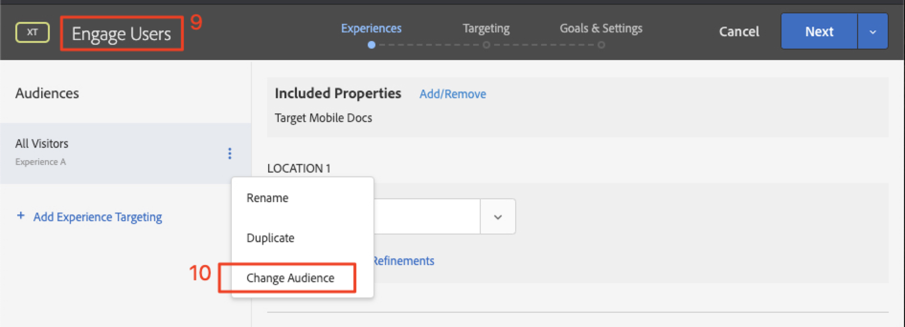
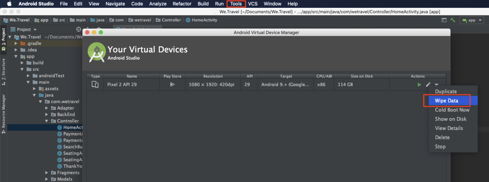
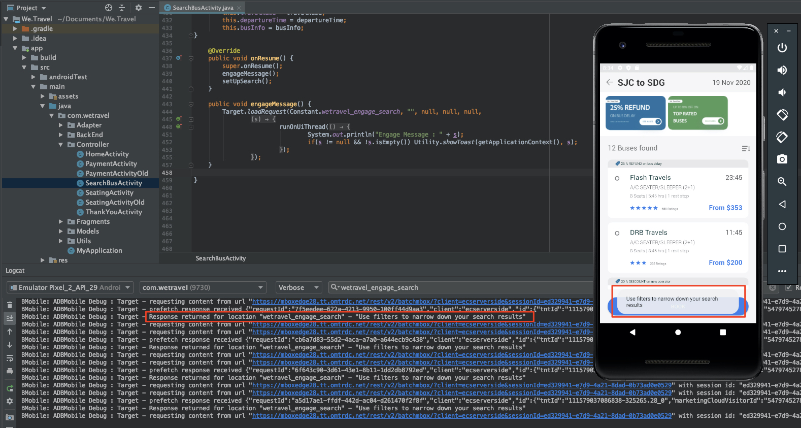

# 레이아웃 개인화

이제 모든 것을 통합하고 개인화된 경험을 만들 차례입니다. _Activity_&#x200B;은(는) 위치, 대상 및 오퍼를 함께 연결하는 [!DNL Target] 메커니즘으로, 앱에서 요청을 수행하면 [!DNL Target]이(가) 개인화된 콘텐츠에 응답합니다. [!DNL Target]에서 두 개의 개인화 활동을 빌드하고 개인화된 콘텐츠가 올바른 시간과 올바른 위치에 올바른 사용자에게 표시되는지 확인합니다.

## 학습 목표

이 단원을 마치면 다음을 수행할 수 있습니다.

* Adobe Target에서 활동 작성
* 샘플 앱의 활동 유효성 검사

## Adobe Target에서 활동 만들기

참여 사용자 및 컨텍스트 오퍼 활동을 만드는 방법을 알아봅니다.

### 첫 번째 활동 - &quot;사용자 참여&quot;

빌드할 활동에 대한 요약은 다음과 같습니다.

| 대상자 | 위치 | 오퍼 |
|---|---|---|
| 새 모바일 앱 사용자 | wetravel_engage_home, wetravel_engage_search | 홈: 신규 사용자 참여, 검색: 신규 사용자 참여 |
| 모바일 앱 사용자 반환 | wetravel_engage_home, wetravel_engage_search | 홈: 재방문 사용자, default_content |

[!DNL Target] 인터페이스에서 다음을 수행합니다.

1. **[!UICONTROL Activities]** > **[!UICONTROL Create Activity]** > **[!UICONTROL Experience Targeting]**&#x200B;을(를) 선택합니다.

   

1. **[!UICONTROL Mobile App]** 아이콘을 클릭합니다.
1. **[!UICONTROL Form composer]** 선택.
1. 작업 영역(이전 단원에서 사용한 것과 동일한 작업 영역)을 선택합니다.
1. 속성(이전 단원에서 사용한 것과 동일한 속성)을 선택합니다.
1. **[!UICONTROL Next]** 아이콘을 클릭합니다.

   

1. 활동 제목을 **[!UICONTROL Engage Users]**(으)로 변경합니다.
1. **[!UICONTROL ellipsis]** > **[!UICONTROL Change Audience]**&#x200B;을(를) 선택합니다.
   
1. 대상을 **[!UICONTROL New Mobile App Users]**(으)로 설정합니다.
1. **[!UICONTROL Done]** 아이콘을 클릭합니다.
   

1. 위치를 _wetravel_engage_home_(으)로 변경합니다.
1. 기본 컨텐츠 옆의 드롭다운 화살표를 선택하고 **[!UICONTROL Change HTML Offer]**&#x200B;을(를) 선택합니다.

   

1. **[!UICONTROL Home: Engage New Users]** 오퍼를 선택하십시오.
1. **[!UICONTROL Done]**&#x200B;을(를) 선택합니다.

   

1. **[!UICONTROL Add Location]**&#x200B;을(를) 선택합니다.
   

1. _wetravel_engage_search_ 위치를 선택하십시오.
1. HTML 오퍼를 변경합니다.

   

1. **[!UICONTROL Search: Engage New Users]** 오퍼를 선택하십시오.
1. **[!UICONTROL Done]** 아이콘을 클릭합니다.

   

방금 대상을 위치 및 오퍼에 연결하여 새 모바일 앱 사용자를 위한 개인화된 환경을 만들었습니다! 이제 경험은 다음과 같아야 합니다.

이제 재방문 모바일 앱 사용자를 위한 환경을 만듭니다.

1. 왼쪽에서 **[!UICONTROL Add Experience Targeting]**&#x200B;을(를) 선택합니다.
1. 대상 **[!UICONTROL Returning Mobile App Users]**&#x200B;을(를) 선택하십시오.
1. **[!UICONTROL Done]**&#x200B;을(를) 선택합니다.
   

이제 이전에 새 경험을 구성하는 데 사용한 것과 동일한 프로세스를 사용하십시오. 재방문 모바일 앱 사용자 경험에 대한 구성은 다음과 같아야 합니다.

설정의 다음 화면으로 넘어가겠습니다.

1. **[!UICONTROL Next]**&#x200B;을(를) 클릭하여 **[!UICONTROL Targeting]** 화면으로 이동합니다.
1. 타깃팅에 기본 설정을 사용합니다. 겹치는 대상(예: _뉴욕 사용자_ 및 _처음 사용자_)에 대한 경험이 있는 경우 이 화면에서 우선 순위를 정렬할 수 있습니다.
1. **[!UICONTROL Next]**(으)로 이동하려면 **[!UICONTROL Goals & Settings]**&#x200B;을(를) 클릭하십시오.

   

이제 활동 설정을 완료하겠습니다.

1. **[!UICONTROL Primary Goal]**&#x200B;을(를) **[!UICONTROL Conversion]**(으)로 설정합니다.
1. 작업을 **[!UICONTROL Viewed an mbox]** > _wetravel_context_dest_(이 위치는 확인 화면에 있으므로 전환을 측정하는 데 사용할 수 있음)로 설정합니다.

   

1. 화면의 다른 모든 설정은 기본값으로 유지합니다.
1. **[!UICONTROL Save & Close]**&#x200B;을(를) 클릭하여 활동을 저장합니다.
1. 다음 화면에서 **[!UICONTROL Activity]**&#x200B;을(를) 활성화합니다.

이제 첫 번째 활동이 시작되었으며 테스트할 준비가 되었습니다!

### 두 번째 활동 - &quot;컨텍스트 기반 오퍼&quot;

빌드할 두 번째 활동에 대한 요약은 다음과 같습니다.

| 대상자 | 위치 | 오퍼 |
| --- | --- | --- |
| 목적지: 샌디에이고 | wetravel_context_dest | 샌디에이고 프로모션 |
| 목적지: 로스앤젤레스 | wetravel_context_dest | 로스앤젤레스 프로모션 |

다음 활동 - &quot;컨텍스트 오퍼&quot;에 대해 위와 동일한 프로세스를 반복합니다. 두 경험에 대한 최종 구성은 아래에 나와 있습니다.

#### 샌디에이고

#### 로스앤젤레스

목표 및 설정 단계에서 기본 목표가 예약 확인 화면의 위치로 변경됩니다.

1. **[!UICONTROL Reporting Settings]**&#x200B;에서 **[!UICONTROL Primary Goal]**&#x200B;을(를) **[!UICONTROL Conversion]**(으)로 설정합니다.
1. 작업을 **[!UICONTROL Viewed an mbox]** > _wetravel_context_dest_(으)로 설정하십시오. (이 활동에서는 이 지표가 환경을 제공하는 동일한 위치이기도 하므로 기본적으로 의미가 없습니다.)
1. **[!UICONTROL Save & Close]** 아이콘을 클릭합니다.

다음 화면에서 활동을 활성화합니다.

이제 두 번째 활동이 시작되었으며 테스트할 준비가 되었습니다!

## 홈 오퍼 유효성 검사

에뮬레이터를 실행하고 홈 화면 하단에 표시할 첫 번째 오퍼를 확인하십시오. 5개 이상의 앱 시작을 가진 재방문 사용자인 경우 _다시 시작_ 오퍼가 표시됩니다. 새 사용자(앱 실행 수가 5개 미만)인 경우 _새 사용자_ 메시지가 표시됩니다.

새 사용자 오퍼가 표시되지 않으면 에뮬레이터에 대한 데이터를 삭제해 보십시오. 그러면 다음에 앱을 실행할 때 앱 시작이 1로 재설정됩니다. 이 작업은 **[!UICONTROL Tools]** > **[!UICONTROL AVD Manager]**&#x200B;에서 수행됩니다. Logcat이 제대로 작동하지 않는 경우 Android Studio를 다시 시작해야 할 수도 있습니다.

_wetravel_engage_home_&#x200B;을 필터링하여 Logcat에서 응답의 유효성을 검사할 수도 있습니다.

## 검색 오퍼의 유효성 검사

**[!UICONTROL San Jose]**&#x200B;을(를) **[!UICONTROL Departure]**(으)로 선택하고 **[!UICONTROL San Diego]**&#x200B;을(를) **[!UICONTROL Destination]**(으)로 선택한 다음 **[!UICONTROL Find Bus]**&#x200B;을(를) 클릭하여 사용 가능한 버스를 검색합니다.

결과 화면에 _필터 사용_ 메시지가 표시됩니다. 5개 이상의 앱 시작을 가진 재방문 사용자의 경우 이 위치(비어 있음)에 대해 기본 콘텐츠가 설정되어 있으므로 여기에 메시지가 표시되지 않습니다.

## 감사 인사 화면에서 컨텍스트 오퍼의 유효성 검사

이제 예약 프로세스를 계속 진행합니다.

* 결과 화면에서 버스를 선택합니다.
* 체크아웃 화면에서 시트를 선택합니다.
* 결제 화면에서 **[!UICONTROL Credit Card]**&#x200B;을(를) 선택합니다. 결제 정보를 비워 두면 실제 예약이 수행되지 않습니다.

샌디에이고가 대상으로 선택되었으므로 확인 화면에 _DJ SAM_ 오퍼 배너가 표시됩니다.

이제 **[!UICONTROL Done]**&#x200B;을(를) 선택하고 Los Angeles를 대상으로 다른 예약을 시도하십시오. 확인 화면에 _Universal Studios_ 배너가 표시됩니다.

## 결론

축하합니다! Android 자습서의 Adobe Target SDK 4.x 주요 부분을 마무리합니다. 이제 Android 앱에서 개인화를 구현할 수 있는 기술을 보유하고 있습니다! 향후 프로젝트에 대한 참조로 이 설명서 및 데모 앱을 참조할 수 있습니다.

다음: 기능 플래그 지정은 Android의 Adobe Target으로 구현할 수 있는 또 다른 기능입니다. 기능 플래그에 대해 알아보려면 다음 단원을 확인하십시오.

**[다음 : 기능 플래그 지정 >](feature-flagging.md)**
