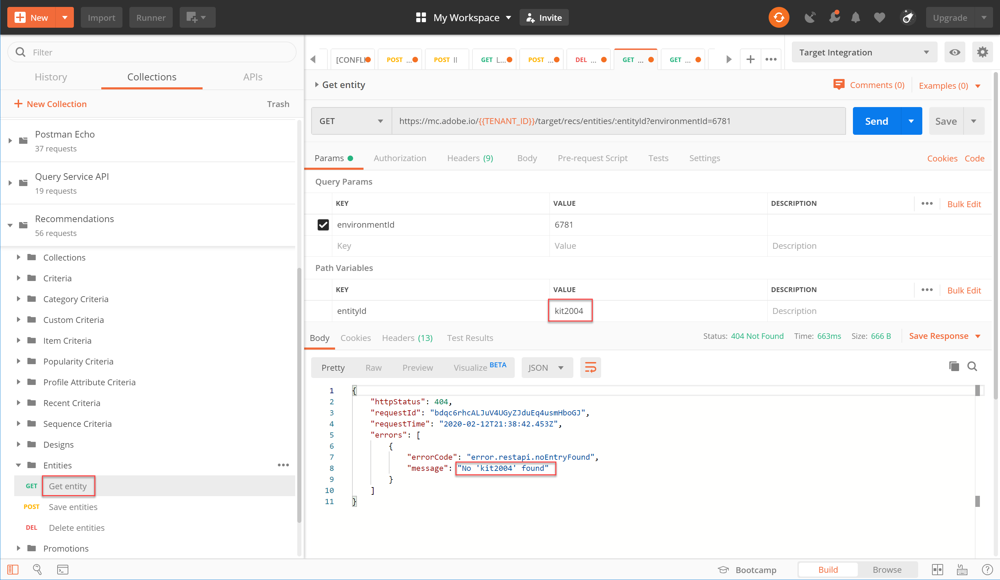

# API를 사용하여 [!DNL Recommendations] 카탈로그 관리

이 시점에서 JWT 인증 흐름을 사용하여 Adobe I/O와 함께 Adobe Target 관리 API를 사용하는 액세스 토큰을 생성하는 방법을 알아보았습니다.

권장 사항 카탈로그의 항목을 추가, 업데이트 또는 [삭제하는](https://developers.adobetarget.com/api/recommendations/) 데 Recommendations API를 사용할 수 있습니다. 나머지 Adobe Target 관리 API와 마찬가지로 API도 인증이 [!DNL Recommendations] 필요합니다.

>[!TIP]
>
>IMS **[!UICONTROL 전송:JWT 액세스 토큰이 24시간 후 만료되므로 인증을 위해 액세스 토큰을 새로 고쳐야 할 때마다 사용자 토큰]** 요청을 통해 + 인증을 생성합니다. 지침은 [Adobe API 인증](../apis/configure-io-target-integration.md) 구성을 참조하십시오.


>[!NOTE]
>
>계속하기 전에 [Recommendations 포스트만 컬렉션을 받으십시오](https://developers.adobetarget.com/api/recommendations/#section/Postman).

## 개체 저장 API를 사용하여 항목 만들기 및 업데이트

CSV 제품 피드 또는 제품 페이지에서 실행되는 [!DNL Recommendations] 요청 대신 API를 사용하여 [!DNL Target] 제품 데이터베이스를 채우려면 개체 [저장 API를 사용하십시오](https://developers.adobetarget.com/api/recommendations/#operation/saveEntities). 이 요청은 단일 [!DNL Target] 환경에서 항목을 추가하거나 업데이트합니다. 구문은 다음과 같습니다.

```
POST https://mc.adobe.io/{{TENANT_ID}}/target/recs/entities
```

예를 들어 개체 저장은 해당 항목에 플래그를 지정하고 권장되지 않도록 하기 위해 재고 또는 가격 임계값과 같은 특정 임계값이 충족될 때마다 항목을 업데이트하는 데 사용할 수 있습니다.

1. > **[!DNL Target]>[!UICONTROL 설정]>[!UICONTROL 호스트][!UICONTROL >]** 환경으로 [!DNL Target] 이동하여 항목을 추가하거나 업데이트할 환경 ID를 가져옵니다.

   

2. 앞에서 설정된 포스트만 환경 변수를 확인하고 `TENANT_ID` `API_KEY` 참조합니다. 비교를 위해 아래 이미지를 사용하십시오. 필요한 경우 아래 이미지에 있는 것과 일치하도록 API 요청의 헤더와 경로를 수정합니다.

   

3. JSON을 본문에 **원시** 코드로 **입력합니다**. 변수를 사용하여 환경 ID를 지정하는 것을 잊지 `environment` 마십시오. (아래 예에서 환경 ID는 6781입니다.)

   

   >!![NOTE]
   아래는 토스터기 오븐 제품의 관련 엔티티 값과 함께 entity.id kit2001을 환경 6781에 추가하는 샘플 JSON입니다.

   ```
      {
      "entities": [{
              "name": "Toaster Oven",
              "id": "kit2001",
              "environment": 6781,
              "categories": [
                  "housewares:appliances"
              ],
              "attributes": {
                  "inventory": 77,
                  "margin": 23,
                  "message": "crashing helicopter",
                  "pageUrl": "www.foobar.foo.com/helicopter.html",
                  "thumbnailUrl": "www.foobar.foo.com/helicopter.jpg",
                  "value": 19.2
              }
          }]
      }
   ```

4. **보내기**&#x200B;를 클릭합니다. 다음 응답을 수신해야 합니다.

   

JSON 개체는 여러 제품을 보내도록 확장할 수 있습니다. 예를 들어, 이 JSON은 두 개의 개체를 지정합니다.

```
    {
        "entities": [{
                "name": "Toaster Oven",
                "id": "kit2001",
                "environment": 6781,
                "categories": [
                    "housewares:appliances"
                ],
                "attributes": {
                    "inventory": 89,
                    "margin": 11,
                    "message": "Toaster Oven",
                    "pageUrl": "www.foobar.foo.com/helicopter.html",
                    "thumbnailUrl": "www.foobar.foo.com/helicopter.jpg",
                    "value": 102.5
                }
            },
            {
                "name": "Blender",
                "id": "kit2002",
                "environment": 6781,
                "categories": [
                    "housewares:appliances"
                ],
                "attributes": {
                    "inventory": 36,
                    "margin": 5,
                    "message": "Blender",
                    "pageUrl": "www.foobar.foo.com/helicopter.html",
                    "thumbnailUrl": "www.foobar.foo.com/helicopter.jpg",
                    "value": 54.5
                }
            }
        ]
    }
```

1. 이제 네 차례야! 개체 **저장** API를 사용하여 다음 항목을 카탈로그에 추가합니다. 위의 샘플 JSON을 시작점으로 사용하십시오. (추가 개체를 포함하려면 JSON을 확장해야 합니다.)

   

이런, 그 마지막 두 항목은 어울리지 않아 보인다. Get Entity **API를 사용하여 이러한 API를 검사하고 필요한 경우 개체** 삭제 **API를 사용하여 API를** 삭제하겠습니다.

## Get Entity API를 사용하여 항목 세부 사항 가져오기

기존 항목의 세부 사항을 검색하려면 엔티티 [가져오기 API를 사용합니다](https://developers.adobetarget.com/api/recommendations/#operation/getEntity). 구문은 다음과 같습니다.

```
GET https://mc.adobe.io/{{TENANT_ID}}/target/recs/entities/[entity.id]
```

엔티티 세부 사항은 한 번에 하나의 엔티티에 대해서만 검색할 수 있습니다. Get Entity를 사용하여 카탈로그에 업데이트가 예상대로 수행되었는지 확인하거나, 또는 카탈로그의 컨텐츠를 감사할 수 있습니다.

1. API 요청에서 변수를 사용하여 엔티티 ID를 지정합니다 `entityId`. 다음 예제에서는 entityId=kit2004의 엔티티에 대한 세부 정보를 반환합니다.

   

2. 앞에서 설정된 포스트만 환경 변수를 확인하고 `TENANT_ID` `API_KEY` 참조합니다. 비교를 위해 아래 이미지를 사용하십시오. 필요한 경우 아래 이미지에 있는 것과 일치하도록 API 요청의 헤더와 경로를 수정합니다.

   

3. 요청 전송

   위의 예에서 보듯이 엔티티를 찾을 수 없다는 오류가 표시되면 올바른 [!DNL Target] 환경에 요청을 제출하는지 확인하십시오.

   >[!NOTE]
   명시적으로 지정된 환경이 없으면 Get Entity가 [기본 환경에서만 엔티티를 가져오려고 시도합니다](https://docs.adobe.com/content/help/en/target/using/administer/hosts.html#section_4F8539B07C0C45E886E8525C344D5FB0) . 기본 환경 이외의 환경에서 가져오려는 경우 환경 ID를 지정해야 합니다.

4. 필요한 경우 매개 `environmentId` 변수를 추가하고 요청을 다시 전송합니다.

   

5. 이번에는 다른 **엔티티** 가져오기 요청을 보내 entityId=kit2005의 엔티티를 검사합니다.

   

이러한 개체를 카탈로그에서 제거해야 한다고 가정해 봅시다. 개체 **삭제** API를 사용하겠습니다.

## 개체 삭제 API를 사용하여 항목 삭제

카탈로그에서 항목을 제거하려면 개체 [삭제 API를 사용합니다](https://developers.adobetarget.com/api/recommendations/#operation/deleteEntities). 구문은 다음과 같습니다.

```
DELETE https://mc.adobe.io/{{TENANT_ID}}/target/recs/entities?ids=[comma-delimited-entity-ids]&environment=[environmentId]
```

>[!WARNING]
이 API는 지정한 ID에서 참조하는 개체를 삭제합니다.
개체 ID가 제공되지 않으면 주어진 환경의 모든 개체가 삭제됩니다. 환경 ID가 제공되지 않으면 모든 환경에서 개체가 삭제됩니다. 이것을 조심해서 사용하세요!

1. > **[!DNL Target]설정[!UICONTROL > 호스트][!UICONTROL >]환경[!UICONTROL 으로 이동하여 항목을 삭제하려는 환경 ID를]** [!DNL Target] 가져옵니다.

   

2. API 요청에서 구문(쿼리 매개 변수)을 사용하여 삭제할 엔티티의 엔티티 ID를 지정합니다 `&ids=[comma-delimited-entity-ids]` . 둘 이상의 엔티티를 삭제할 때는 쉼표로 ID를 구분합니다.

   

3. 구문을 사용하여 환경 ID를 지정합니다. 그렇지 않으면 모든 환경 `&environment=[environmentId]`에서 엔티티가 삭제됩니다.

   

4. 앞에서 설정된 포스트만 환경 변수를 확인하고 `TENANT_ID` `API_KEY` 참조합니다. 비교를 위해 아래 이미지를 사용하십시오. 필요한 경우 아래 이미지에 있는 것과 일치하도록 API 요청의 헤더와 경로를 수정합니다.

   

5. 요청 전송

   

6. 삭제된 엔터티를 찾을 수 없다는 **Get Entity**&#x200B;를 사용하여 결과를 확인합니다.

   

   

축하합니다! 이제 [!DNL Recommendations] API를 사용하여 카탈로그의 개체에 대한 세부 정보를 만들고, 업데이트하고, 삭제하고, 얻을 수 있습니다. 다음 섹션에서는 사용자 지정 기준을 관리하는 방법을 알아봅니다.

[다음 &quot;사용자 지정 기준 관리&quot; >](manage-custom-criteria.md)
