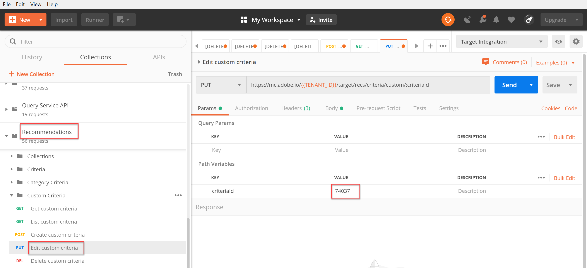

# 사용자 지정 기준 관리

경우에 따라, 제공된 알고리즘이 홍보할 특정 항목을 표시하지 [!DNL Recommendations] 못할 수 있습니다. 이러한 경우 사용자 지정 기준은 지정된 키 항목 또는 범주에 대해 특정 권장 항목 세트를 제공할 수 있는 방법을 제공합니다. 주요 항목 또는 카테고리와 권장 항목 간의 매핑을 정의하고 해당 매핑을 사용자 지정 기준으로 가져옵니다. 이 프로세스는 [사용자 지정 기준 설명서에 설명되어 있습니다](https://docs.adobe.com/content/help/en/target/using/recommendations/criteria/recommendations-csv.html). 이 설명서에 언급된 대로 사용자 인터페이스(UI)를 통해 사용자 지정 기준을 만들고, 편집하고, 삭제할 수 [!DNL Target] 있습니다. 하지만 사용자 지정 기준을 보다 세부적으로 관리할 수 있도록 해주는 사용자 지정 기준 API 세트도 [!DNL Target] 제공합니다.

>[!IMPORTANT]
>
>사용자 지정 기준에 대해 다음 사용 지침을 따르십시오.
>
> API를 사용하여 지정된 사용자 지정 기준에 대해 모든 작업(만들기, 편집, 삭제)을 수행하거나, UI를 사용하여 모든 작업(만들기, 편집, 삭제)을 수행합니다. UI와 API의 조합을 통해 사용자 지정 기준을 관리하면 정보가 충돌하거나 예기치 않은 결과가 발생할 수 있습니다. 예를 들어 UI에서 사용자 지정 기준을 만든 다음 API를 통해 편집하면 API를 통해 볼 수 있는 것처럼 백엔드에서 업데이트되더라도 UI에 사용자 지정 기준이 반영되지 않습니다.

## 사용자 지정 기준 만들기

사용자 지정 기준 API [를 사용하여 사용자 지정 기준을 만들려면](https://developers.adobetarget.com/api/recommendations/#operation/createCriteriaCustom)구문은 다음과 같습니다.

`POST https://mc.adobe.io/{{TENANT_ID}}/target/recs/criteria/custom`

>[!WARNING]
>
>이 연습에 설명된 대로 사용자 지정 기준 만들기 API를 사용하여 만든 사용자 지정 기준은 UI에 나타나며 여기서 유지됩니다. UI에서 편집하거나 삭제할 수 없습니다. API를 **통해 편집하거나 삭제할**&#x200B;수 있지만 어느 쪽이든 UI에 계속 표시됩니다 [!DNL Target] . UI에서 편집 또는 삭제 옵션을 유지하려면 사용자 지정 기준 만들기 API를 사용하는 것 [과 반대로 설명서별로](https://docs.adobe.com/content/help/en/target/using/recommendations/criteria/recommendations-csv.html)UI를 사용하여 사용자 지정 기준을 만듭니다.

위의 경고를 읽은 후에만 이 튜토리얼을 진행하면 나중에 UI에서 삭제할 수 없는 새로운 사용자 정의 기준을 만들 수 있습니다.

1. 사용자 지정 기준 `TENANT_ID` 만들기 `API_KEY` 는 이전에 설정한 Postman 환경 변수를 **** 참조합니다. 비교를 위해 아래 이미지를 사용하십시오.

   

2. 사용자 지정 기준 **CSV** 파일의 위치를 정의하는 **원시** JSON으로 본문을 추가합니다. 사용자 지정 기준 API [작성](https://developers.adobetarget.com/api/recommendations/#operation/getAllCriteriaCustom) 문서에 제공된 예제를 템플릿으로 사용하여 사용자 `environmentId` 및 기타 값을 필요에 따라 제공합니다. 이 예에서는 LAST_PURCHASED를 키로 사용합니다.

   

3. 요청을 보내고 방금 만든 사용자 지정 기준의 세부 사항이 포함된 응답을 확인합니다.

   

4. 사용자 지정 기준이 생성되었는지 확인하려면 Adobe Target에서 **[!UICONTROL Recommendations]>[!UICONTROL 기준을]** 탐색하여 이름별로 기준을 검색하거나 다음 단계에서 **목록 사용자 지정 기준 API를** 사용하십시오.

   

이 경우 오류가 있습니다. 사용자 지정 기준 **목록 API를 사용하여 사용자 지정 기준을 보다 자세히 검사하여 오류를 조사하겠습니다**.

## 목록 사용자 지정 기준

각 사용자 지정 기준의 세부 사항과 함께 모든 사용자 지정 기준 목록을 검색하려면 [목록 사용자 지정 기준 API를 사용하십시오](https://developers.adobetarget.com/api/recommendations/#operation/getAllCriteriaCustom). 구문은 다음과 같습니다.

`GET https://mc.adobe.io/{{TENANT_ID}}/target/recs/criteria/custom`

1. 전과 `TENANT_ID` 같이 확인하고 `API_KEY` 요청을 전송합니다. 응답에서 사용자 지정 기준 ID와 앞서 언급한 오류 메시지에 대한 세부 사항을 확인하십시오.
   

이 경우 서버 정보가 잘못되었기 때문에 오류가 발생했습니다. 즉, 사용자 지정 기준 정의를 포함하는 CSV 파일에 액세스할 수 [!DNL Target] 없습니다. 이 문제를 해결하기 위해 사용자 지정 기준을 편집해 보겠습니다.

## 사용자 지정 기준 편집

사용자 지정 기준 정의의 세부 사항을 변경하려면 사용자 지정 기준 [편집 API를 사용합니다](https://developers.adobetarget.com/api/recommendations/#operation/updateCriteriaCustom). 구문은 다음과 같습니다.

`POST https://mc.adobe.io/{{TENANT_ID}}/target/recs/criteria/custom/:criteriaId`

1. 확인 `TENANT_ID` 및 `API_KEY`전과 같이
   

1. 편집할 (단일) 사용자 지정 기준의 기준 ID를 지정합니다.
   

1. 본문에서는 업데이트된 JSON과 올바른 서버 정보를 제공합니다. 이 단계에서는 액세스할 수 있는 서버에 대한 FTP 액세스를 지정합니다.
   

1. 요청을 보내고 응답을 기록합니다.
   

사용자 지정 기준 **가져오기 API를 사용하여 업데이트된 사용자 지정 기준의 성공을 확인하겠습니다**.

## 사용자 지정 기준 가져오기

특정 사용자 지정 기준에 대한 사용자 지정 기준 세부 사항을 보려면 사용자 지정 기준 [가져오기 API를 사용하십시오](https://developers.adobetarget.com/api/recommendations/#operation/getCriteriaCustom). 구문은 다음과 같습니다.

`GET https://mc.adobe.io/{{TENANT_ID}}/target/recs/criteria/custom/:criteriaId`

1. 세부 사항을 가져올 사용자 지정 기준의 기준 ID를 지정합니다. 요청을 보내고 응답을 검토합니다.
   
1. 성공 확인 (이 경우 더 이상 FTP 오류가 없는지 확인하십시오.)
   
1. (선택 사항) UI에서 업데이트가 정확하게 반영되는지 확인합니다.
   

## 사용자 지정 기준 삭제

앞서 언급한 기준 ID를 사용하여 사용자 지정 기준 [삭제 API를 사용하여 사용자 지정 기준을 삭제합니다](https://developers.adobetarget.com/api/recommendations/#operation/deleteCriteriaCustom). 구문은 다음과 같습니다.

`DELETE https://mc.adobe.io/{{TENANT_ID}}/target/recs/criteria/custom/:criteriaId`

1. 삭제할 (단일) 사용자 지정 기준의 기준 ID를 지정합니다. **보내기**를 클릭합니다.
   

1. 사용자 지정 기준 가져오기를 사용하여 기준이 삭제되었는지 확인합니다.
   이 경우 예상 404 오류는 삭제된 기준을 찾을 수 없음을 나타냅니다.

>[!NOTE]
>사용자 지정 기준 만들기 API를 사용하여 만들었기 때문에 UI가 삭제되어도 기준이 [!DNL Target] UI에서 제거되지 않습니다.

축하합니다! 이제 [!DNL Recommendations] API를 사용하여 사용자 지정 기준을 만들고, 나열하고, 편집하고, 삭제하고, 자세한 내용을 볼 수 있습니다. 다음 섹션에서는 Delivery API를 사용하여 권장 사항을 [!DNL Target] 검색합니다.

[다음 &quot;서버측 전달 API를 사용하여 Recommendations 가져오기&quot; >](fetch-recs-server-side-delivery-api.md)
